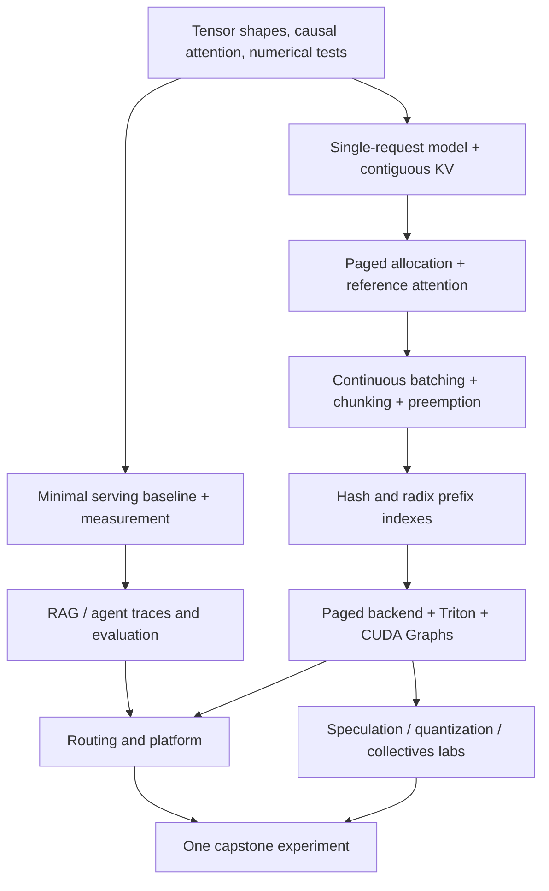

# InferLab — learning and execution plan (v3)

Reviewed 2026-09-28. **Recommendation: keep the three-layer project and every topic; reduce repeated implementation and integration work.** Build a defensible inference runtime, operate a small serving platform, and use RAG/agent traffic to answer one systems question.

This is an LLM inference and serving specialization, not a comprehensive curriculum in all ML systems. Training, data pipelines, compilers and other accelerators have bounded bridge lessons below. Becoming equally deep in all of them before graduation is not a credible promise.

## Start here

| File | Purpose / delivery status |
|---|---|
| This file | Authoritative scope, sequence, hours, milestones and experiment contract |
| [Critical review](docs/PLAN_REVIEW.md) | What was strong, what needed correction, and checked primary resources |
| [Teaching curriculum](teaching/CURRICULUM.md) | Detailed HTML lesson and code-delivery specification, module by module |
| [First HTML lesson](teaching/slides/00-orientation.html) | Delivered orientation and measurement foundations, with notes, exercises and interactive calculators |
| [Supplied starter code](starter/README.md) | Delivered experiment-bundle and budget/report tooling; no GPU or dependencies required |
| [Original v2](docs/archive/PROJECT_PLAN_v2.md) | Preserved verbatim, including all concept cards, papers, course mappings and electives |

The v2 concept catalog remains a useful reference, but its deadlines, mandatory assignments, exactness rules, cut order and unqualified compatibility claims are superseded here. Other HTML lessons and runtime/platform code are **planned**, not already implemented.

## 1. Assessment and design decision

The strongest part of v2 is the connection between **memory management, scheduling, routing and application traces**. Preserve it. A working paged runtime with cancellation/preemption tests and a reproducible routing study is substantial solo engineering even if its HTTP server, dashboards and deployment templates are supplied.

The limiting factor is not topic coverage. It is the number of simultaneous first-time implementations and the debugging between them. In v2, one 15–20-hour week includes learning CUDA, a FlashAttention assignment, integrating paged attention, capturing CUDA Graphs, writing Triton kernels, writing a CUDA extension and profiling. That is not a reasonable planning unit. Likewise, 100–200 hand-checked RAG questions, three MCP tools and thousands of traces cannot be assumed to fit into two weeks from a blank repository.

Use four learning modes:

| Mode | Your responsibility | What can be provided |
|---|---|---|
| **Build** | Design and implement the mechanism; defend invariants and measure it | Interfaces, fixtures, hints, independent correctness checks |
| **Modify** | Explain supplied code, make a substantive change, test it | Complete baseline and integration glue |
| **Operate** | Deploy, configure, measure, break and diagnose a real implementation | Versioned launch scripts and manifests |
| **Explain** | Derive the mechanism and solve a concrete exercise | Annotated reference, small executable example or recorded profile |

“Provided” means lower value to reimplement **for this project**, not unimportant engineering. Reading supplied code alone does not earn an implementation claim. For every supplied component, trace one request, change one behavior, and explain one failure. Keep authorship in the README: learner-authored, adapted, or supplied.

## 2. Assumptions and realistic completion envelope

**Confirmed by you:** graduate May 2027; prioritize the most important topics before December 2026; study 20+ hours/week; use an AI coding agent after understanding the mechanism; GPU budget of a few hundred dollars. Retain the M4 MacBook/16 GB assumption from v2. You have used Python/PyTorch/transformers; CUDA and Kubernetes are new. Your PennCloud C++ distributed KV/HTTP/failure-recovery work and PennOS C scheduler/process/resource-cleanup work are strong foundations. Only the exact cash ceiling remains unconfirmed.

Interpret the early target in two stages: **fundamentals by November 29**, then **GPU integration and a first routing demo by December 20**. If “before December” means strictly November 30, the first stage is the commitment; the fully integrated demo needs the December work. Aim to finish the full track in April, leaving room before May graduation.

**Effort baseline: 496 planned learner hours**, including lessons, implementation, tests, experiments and writing; roughly 440–560 hours is a planning range, not a forecast validated by data. The December subset takes **286 h**, with the remaining **210 h** in January–April. Reference code and lesson preparation are assistance outside learner hours; review and modification are included.

| Fall pace over Oct 5–Dec 20 (11 weeks) | Available hours | Honest expectation |
|---|---:|---|
| 20 h/week | 220 | Fundamental engine work; full December subset needs ~66 h moved to January |
| 24 h/week | 264 | Near target, but ~22 h short of baseline and little buffer |
| **26 h/week** | **286** | Matches the December work estimate; still ambitious |
| 28 h/week | 308 | Adds ~22 h of fall integration/exam contingency |

Recommended fall allocation: **26 planned hours/week, with flexibility up to 28**. January–April requires about 15 h/week over 14 active weeks for the remaining 210 hours. Reserve late April for clean reproduction and graduation/recruiting interruptions. There is no assumption that AI makes debugging, GPU queues, numerical validation or learning instantaneous.

AI is most useful for transport adapters, deployment files, test fixtures, loader mappings, build errors and implementing a design you have already explained. For core mechanisms: write a short design/state trace first; let the agent help implement; then inspect the diff, predict a failure, run an independent oracle, and reconstruct the key algorithm without assistance. A passing generated test that repeats the generated implementation is weak evidence.

Use your background to compress introductory material: allocate A’s 32 hours to an 8-hour transformer/numerical diagnostic, 12 hours of GPU execution/memory foundations and 12 hours of container/Kubernetes foundations, delivered just before use. Reallocate refresh time to CUDA/Kubernetes if the diagnostic is easy. If genuine prerequisite gaps need more than 32 hours, shift secondary integration to January. Re-estimate after two weeks using actual time spent. Faster code production is upside, not an excuse to spend the entire contingency in advance.

**Weekly rhythm at 26 h:** 4 h lessons/readings, 12 h implementation or guided labs, 5 h tests/experiments, 3 h analysis/write-up, 2 h retrieval practice/planning. Keep one principal implementation task active. AI-assisted boilerplate happens alongside this, with review counted in the implementation time.

## 3. The learning sequence

**Personalized starting point:** do not rebuild an HTTP server, distributed KV store, OS scheduler, WAL or Raft-style control plane. PennOS gives you useful intuition for ownership, lifecycle, priority and starvation; GPU memory still requires learning streams/events, asynchronous execution and device layouts. PennCloud gives you routing, replication and failure intuition; a prefix cache contains derived state, and recomputation/eviction semantics differ from a durable store. Kubernetes introduces a declarative reconciliation loop, readiness and scheduling/resource contracts. These are the new topics to teach carefully.


Start with a short foundation and one request end to end. Run a production server early, but postpone interpreting many advanced tuning knobs until their mechanisms are understood. Study each major idea twice: a small worked example, then the mechanism in the real system.



Do not require a tiled CUDA matmul or an entire training framework as an entrance exam. Before engine work you need tensor shapes, causal masking, RoPE positions, KV semantics, stable softmax and basic PyTorch. Before kernel work you need threads/warps, memory hierarchy, synchronization and profiling. Before platform work you need pods/services, readiness and resource requests. Teach these immediately before use.

## 4. Coverage and ownership — nothing disappears

### 4.1 Deep implementation spine

| Topic / tool | Mode | You implement or prove | Supplied assistance |
|---|---|---|---|
| Python/PyTorch, transformer inference | Build | Attention, RoPE/GQA/QK norm, cache append, prefill/decode on a fixed dense Qwen3 revision | Weight-name mapping, tokenizer/chat-template adapter, CLI and model download plumbing |
| KV accounting, MHA/MQA/GQA | Build | Memory calculator and measured allocation analysis | Model-config fixtures |
| Paged KV and PagedAttention | Build + integrate | Pool, tables, slot mapping, refcounts, copy-on-write, ownership invariants; integrate direct paged reads | FlashInfer adapter skeleton and shape fixtures |
| Continuous batching, chunked prefill, recompute preemption | Build | Scheduler state machine, token budget, fairness and cancellation | Fake executor, virtual clock and trace visualizer |
| Block-hash and radix prefix caching | Build | Both indexes over the SAME pool, page size and scheduler; eviction/locking tests | Tree printer and adversarial token sequences |
| CUDA Graphs and CPU/GPU overlap | Modify | Bucket buffers and safe padded execution; explain a captured trace; bounded overlap exercise | Capture/replay lifecycle and stream/event scaffolding; full async pipeline not a core integration requirement |
| Triton, CUDA C++, torch.compile, Nsight | Build + modify | One Triton RMSNorm or fused residual/RMSNorm; modify equivalent CUDA C++ kernel; profile both | CUDA extension build machinery, baseline CUDA kernel and benchmark driver |
| FlashAttention/Flash-Decoding/FlashInfer | Modify + integrate | Derive online softmax; complete selected tiled forward steps; explain split-KV and layouts | Annotated attention example, no requirement to finish all of CS336 A2 |
| Measurement, SLOs, trace replay | Build | Arrival scheduling, streaming event model, metrics, goodput, causal replay | Transport/SSE parsing, bundle writer, plotting/style and report scaffolding |
| Go and gateway scoring | Build | Pure scoring function, stale-metric fallback, locality/load trade-off tests | EPP plugin registration, API-version glue, chart and fixtures |

### 4.2 Applied and production breadth

| Topic / tool | Mode | Required learning artifact | Bound on scope |
|---|---|---|---|
| vLLM and SGLang | Operate both | Same-model baseline and a mechanism-linked tuning explanation | One primary engine per advanced lab; second engine gets selected cross-checks |
| RAG, embeddings, BM25, vector DB, RRF, reranking | Modify + build experiments | Retrieval and answer-quality ablations; trace stage timings | One corpus, one vector store (Qdrant default), fixed embedding/reranking revisions; pgvector comparison exercise |
| Agents, MCP SDK, structured output, XGrammar | Modify | Thin loop with budgets, trace dependencies, schema vs semantic validation, failure fixtures | `docs_search`, read-only benchmark SQL and a supplied constrained execution tool; no general agent framework build |
| Docker, kind/k3s, Kubernetes, GPU Operator/device plugin, Helm/Kustomize | Operate | Reproduce deployment, diagnose readiness/resource failure | One gateway implementation, one deployment packaging path; explain the alternative |
| Gateway API Inference Extension, llm-d | Operate + build scorer | Custom Go scorer integrated with the pinned EPP; backend contract test | Supplied control-plane setup; one model pool with two comparable replicas per routing experiment |
| Prometheus, Grafana, DCGM, OpenTelemetry, Jaeger/Tempo | Operate + modify | One dashboard query and one end-to-end trace you can explain | Provided dashboards/collector configuration; choose Tempo or Jaeger, inspect the other |
| KEDA/HPA, cold start, admission, fairness, drain | Operate + build policy | Scale-up on existing GPU capacity, overload/cancel/drain test | Supplied manifests; no cloud node autoscaler implementation |
| LMCache and HiCache / native offload | Operate primary, inspect alternative | Measured restore/recompute crossover and cache occupancy | One host-memory tier; no mandatory remote storage fleet |
| Multi-LoRA, S-LoRA/Punica | Operate | Two compatible adapters, cache-key separation, residency exercise | Provided adapters; no adapter training dependency |
| Speculative draft-target and n-gram | Build small verifier + operate | Acceptance/residual derivation, rollback tests, a load-dependent comparison | Draft worker and runtime plumbing; own-engine full integration is an extension |
| EAGLE-3, MTP, DFlash, SpecForge/distillation | Operate one supported family; explain others | Compatibility map and supported drafter result | No mandatory drafter training or all-family comparison |
| INT8, GPTQ/AWQ/SmoothQuant, FP8, W4A16, FP8 KV, NVFP4/MXFP4; LLM Compressor, lm-eval | Build math + operate | Group quantizer, calibration/held-out split, quality/latency/memory plot | Conversion/packing/calibration plumbing and evaluator adapter; unsupported hardware formats get numerical labs, never fake throughput |
| TP, DP, PP, FSDP/ZeRO, context parallelism; NCCL/MPI | Build small TP block + operate | Two-rank row/column linear algebra, collective profile, memory/traffic exercise | Distributed launch/sharded loader; full TP in your engine not needed for completion |
| MoE/EP, DP-attention, all-to-all, DeepEP/EPLB | Modify + operate if compatible | Token dispatch/combine lab and load-skew analysis; two-GPU run when supported | Tiny expert fixture and vendor launch recipe; no wide-EP fleet |
| P/D disaggregation, NIXL/Mooncake | Operate + build cost analysis | Transfer benchmark and equal-GPU colocated vs 1P1D comparison | Connector/router scripts; one working transport, inspect the other |
| Reliability, CI, cost, reproducibility | Build policies + use scaffolds | Clean checkout reproduction, failure accounting and regression decision | CI YAML, provision/collect/teardown templates, report generation |

### 4.3 Bounded bridge lessons (retain all v2 electives and broader ML-systems context)

These receive HTML teaching and a concrete exercise within the final survey budget; their former 1–3-week implementation expansions remain optional. “Explain” and “Modify” are honest completion levels, not hidden claims of production experience.

| Bridge | Required exercise | Optional depth after completion |
|---|---|---|
| Advanced kernels: warp specialization, tensor cores, TVM/TIRx, mega-kernels, FlashAttention generations | Annotate a provided matmul/attention profile; calculate roofline; modify a supplied kernel parameter | Own split-KV paged kernel, H100/Blackwell leaderboard |
| Training/autodiff, DP/FSDP/ZeRO, SFT/RLHF/GRPO, verl/Miles/slime, rollout weight sync | Small CPU training/autodiff example, optimizer-memory calculation; walk through supplied rollout/weight-version log | Train a drafter or run a full GRPO loop |
| MLA, sliding-window and hybrid recurrent attention, Qwen3.5/Mamba | Compare state layouts; implement a tiny recurrent-state checkpoint/restore example | Integrate a hybrid model in your engine |
| Multimodal and encoder caching | Run or inspect supplied VLM path, trace encoder/prefill/decode, define image cache identity | Multimodal serving study |
| TPU/JAX, MLX/vllm-metal and Apple Silicon | Run one local MLX example; compare a supplied TPU/JAX example and data layouts | TPU allocation and measured port |
| Rust, SGLang Model Gateway, Dynamo, KServe, DRA/KAI/Grove | Modify a supplied small Rust load-selection example; compare routing/control-plane responsibilities and accelerator allocation | Standalone Rust router or second platform deployment |
| Data and model lifecycle, SQL, artifacts, evaluation leakage, cloud/IaC | Version corpus/model/tokenizer, test held-out split, read a supplied provisioning configuration | Full data platform or training service |

A named alternative is retained for learning, but does not become a second mandatory deployment. This is how the plan preserves breadth without making every tool a new project.

## 5. Calendar, work packages and gates

This calendar is revised around your May graduation and early learning target. Package letters below identify scope; the calendar intentionally overlaps portions of adjacent packages. Break Dec 21–Jan 3. Reserve late April as a buffer.

| Calendar | Hours | Priority and expected gate |
|---|---:|---|
| Oct 5–18 | 52 | A foundations (32 h), first part of B baseline (20 h) |
| Oct 19–Nov 8 | 78 | Finish B (14 h); D model/paging (64 h); early CP1 |
| Nov 9–29 | 78 | Finish D (8 h); E scheduler and both caches (54 h); F GPU foundations (16 h). **Most engine fundamentals learned before December.** |
| Nov 30–Dec 13 | 52 | Finish F (38 h), C minimal RAG/agent trace path (14 h). **CP2 working GPU runtime.** |
| Dec 14–20 | 26 | C trace validation (6 h), G first simulator/gateway/Go-score demo (20 h). **Integrated December checkpoint.** |
| Jan 4–31 | 66 | Finish C (14 h) and G (52 h): full workload eval, GPU replicas, offload, scaling, reliability. **CP3.** |
| Feb 1–28 | 54 | H advanced labs: speculation, quantization, collectives/EP and P/D |
| Mar 1–14 | 36 | I capstone and report. **CP4.** |
| Mar 15–Apr 11 | 54 | J bridge topics, reproduction and release |
| Apr 12–May graduation | Reserved | Catch-up, stronger evidence, interviews; no new core scope |
| **Total** | **496** | **286 h by Dec 20 + 210 h in Jan–Apr** |

The December milestone includes the important conceptual spine: transformer/KV math, measurement, paging, continuous batching, chunking/preemption, both prefix indexes, GPU memory/attention/kernel/graph concepts and a first routing path. The first platform demo is not the finished GPU reliability/scaling study. Advanced topics are introduced in the early overview, then receive their full labs after December; none is removed.

Package budgets below sum to the calendar: A 32 + B 34 + C 34 + D 72 + E 54 + F 54 + G 72 + H 54 + I 36 + J 54 = 496. Synthetic requests are used before the RAG/agent traces exist; replay those real traces in January. This engine-first ordering serves your revised priority better than spending early weeks building applications.

### A. Foundations and setup — 32 h

- [ ] Diagnose tensor broadcasting, causal masks, attention shapes and Python async; fill actual gaps.
- [ ] Trace a five-token prefill and three decode iterations on paper. Explain why Q/K positions change.
- [ ] Compare stable vs naive softmax; implement a tiny attention reference with no cache, then cache it.
- [ ] Calculate KV bytes and weights/workspace/graphs separately; predict a memory ceiling.
- [ ] Use the supplied starter to make an experiment bundle. Learn which provenance fields it does not discover for you.
- [ ] Set up Python environment and CPU CI; pin code/model/tokenizer revisions and one GPU image after a smoke test. Do not install every future library in one environment.

**Exit:** explain each tensor dimension and pass prefill-vs-incremental tests. No GPU required for most of A. If this takes more than two weeks, re-estimate now.

### B. Measurement and early baseline — 34 h

- [ ] Implement metric calculations against synthetic event fixtures before real HTTP traffic.
- [ ] Use supplied HTTP/SSE plumbing; record intended arrival, dispatch, first content, content events and completion, with monotonic timestamps.
- [ ] Implement open-loop arrivals and closed-loop concurrency; detect load-generator dispatch lag.
- [ ] Run Qwen3-0.6B or 1.7B on both engines, then one larger model that fits; match model revision, precision, tokenizer, chat template, generation and context limits.
- [ ] Three load points, two workload shapes, caching off baseline; one prefix-cache ablation. Move FP8/speculation/many-knob sweeps to their teaching modules.
- [ ] Cross-check a matched run with `vllm bench serve` and AIPerf. Explain semantic differences before expecting percent agreement.
- [ ] Read one profiler trace and modify a supplied dashboard. Publish a short baseline report.

**Exit:** CP1 requires raw requests, failures, timing definitions, configuration and one explained finding. No speedup target.

### C. RAG and agent workloads — 34 h using supplied applications

- [ ] One versioned documentation corpus; supplied ingest/store/embedding/reranker plumbing.
- [ ] You implement or modify chunk selection, RRF and prompt layout; compare dense vs hybrid, reranker on/off.
- [ ] Start with 30 hand-checked RAG questions and 15 deterministic agent tasks; keep at least a third held out. Grow toward 100 and 30 respectively during the January completion of C and I/J only if checking fits.
- [ ] Measure recall@k with evidence labels, answer correctness/citation support and stage latency. A fixed LLM judge is supplementary, calibrated against human checks; do not use it as ground truth.
- [ ] Run the supplied thin MCP agent; add step/token/time limits and trace dependencies. SQL uses read-only fixtures. Execution tool uses a supplied restricted container runner; test timeout/network denial without claiming production-grade sandboxing.
- [ ] Record roughly 50 varied sessions initially; repeat for load with explicit cache-reset/reuse policy. Unique-task diversity and load volume are different quantities.
- [ ] Implement the replay modes in §8. Keep live task evaluation separate from fixed-transcript infrastructure replay.

**Exit:** trace artifacts identify content/template versions, tool delays, dependencies, prompt lengths and measurement mode. A small local model may fail tool use; keep deterministic tool fixtures and evaluate real quality on the selected GPU model.

### D. Dense model and paged memory — 72 h

- [ ] Start with the same tiny model revision as B; use a supplied weight loader. Implement and test each dense transformer component.
- [ ] Validate uncached vs contiguous-cache prefill/decode with fixed positions and teacher-forced tokens.
- [ ] Define request states and ownership before optimization. Build the pool, tables and writes; add a gathered PyTorch attention oracle.
- [ ] Test allocation/append/fork/release, shared partial-block copy-on-write, exhaustion and cancellation; assert conservation and no use-after-free.
- [ ] Compare predicted live KV bytes with allocated/reserved device memory. Explain fragmentation and non-KV allocations.
- [ ] Capacity and correctness experiments only; gathered reference attention is not a performance backend.

**Exit:** paged-memory correctness, not yet a claim to have implemented a fast PagedAttention kernel.

### E. Scheduler and prefix caches — 54 h

- [ ] Implement static vs continuous scheduling with an injected virtual clock, then real executor integration.
- [ ] Add token budget, chunked prefill and recompute preemption sequentially. Track scheduled/computed/output tokens separately.
- [ ] Add idempotent cancellation/cleanup, bounded queues and a starvation safeguard before adding LPM.
- [ ] Implement chained block hashes with model/adaptor/tokenizer-relevant identity and tenant namespace. Use one page size initially.
- [ ] Implement radix match/insert/split/lock/evict against the same pool; compare it with hashes under the same scheduling/eviction policy before changing policy.
- [ ] Measure lookup overhead, reused **tokens**, eviction, recomputation, TTFT and waiting-time fairness. Do not presuppose radix wins on branches.

**Exit:** randomized state-machine tests and one isolated ablation per mechanism. If debugging overruns, use a supplied radix baseline and modify/test it; retain learning, label ownership honestly.

### F. GPU execution — 54 h

- [ ] Study online softmax with a small numerical exercise; complete a supplied forward-tiling lab. Full CS336 assignment completion is optional.
- [ ] Integrate a pinned FlashInfer paged prefill/decode path. Test layout, dtype, page-size and tail-length constraints before a sweep.
- [ ] Write one Triton normalization kernel; modify the CUDA C++ reference and its launch parameters. Compare against eager PyTorch and `torch.compile` after warmup.
- [ ] Modify the supplied CUDA Graph runner: stable addresses, input refresh, bucket padding, dummy slots, recapture rules. Ensure padding cannot write into live KV.
- [ ] Annotate Nsight Systems CPU launch gaps; use Nsight Compute on one kernel. Keep profiling runs outside headline timing.
- [ ] Wrap the engine in supplied HTTP/SSE transport; implement cancellation ownership and metrics semantics yourself.

**Exit:** CP2 with end-to-end traces and a measured gap to a same-model vLLM baseline. One independently written kernel is enough; the CUDA C++ exercise still stays.

### G. Platform — 72 h

- [ ] On kind, deploy simulator + one supported gateway/EPP pair using supplied Helm values. Learn readiness/liveness, services, selectors, resource requests, RBAC and failure diagnosis.
- [ ] Implement the Go score as a pure function first. Inputs: queue estimate, reusable tokens estimate, session affinity, health/staleness. Then integrate the provided plugin shell.
- [ ] Test actual metrics parsing/units, routing, streams and disconnects for each backend. Three familiar metric names alone do not establish compatibility.
- [ ] On two GPUs, run **two replicas of one model/engine**, then reuse the node sequentially for another engine. Keep embedding/reranking and tools on CPU where feasible.
- [ ] Compare round-robin, least-queue and bounded prefix affinity. Implement stale-cache-index invalidation after pod restart; label inferred cache locality as an estimate.
- [ ] Run LMCache (or a compatible primary offloader), two LoRA adapters, and KEDA/HPA labs using supplied recipes; inspect alternative HiCache/HPA paths.
- [ ] Scale from one to two replicas on already available GPUs. Measure readiness and cold-cache recovery. A fixed node has no spare capacity beyond its allocated GPUs.
- [ ] Kill/drain a pod, overload the queue and disconnect a client. Verify pre-stream retry vs post-stream failure behavior and resource cleanup. Do not automatically replay already emitted tokens or side-effecting tools.

**Exit:** January CP3 core-completion point: runtime + platform + workloads, with runbooks and reproducible evidence. Single-node tests establish local behavior, not multi-node fault tolerance.

### H. Frontier guided labs — 54 h, deliberately bounded

Allocate approximately 10 h speculation, 12 h quantization, 12 h collectives/EP, 12 h P/D, 8 h comparison/reporting and compatibility work.

- [ ] Speculation: implement the small rejection verifier and n-gram proposal logic; examine rollback. Run one supported production proposer with off/on at low and high load. Study other families via annotated code.
- [ ] Quantization: implement reference groupwise quantization, inspect calibration, run one supported compressed checkpoint and one KV-precision ablation. Keep FP8 and W4A16 in the curriculum; use supplied numerical examples when one cannot run on rented hardware. Test held-out quality.
- [ ] TP/EP: complete a two-rank linear/transformer-block lab; profile all-reduce and dispatch/combine. Run a supported production TP=2 case; EP requires two or more ranks and a supported configuration. MoE active parameters do not determine resident weight memory.
- [ ] P/D: run the supplied transfer benchmark and connector deployment. Compare one prefill + one decode GPU against **two** colocated replicas (and TP=2 if relevant), at equal total GPU count/cost.
- [ ] Record unsupported configurations explicitly. One real run is required for an “operated” claim; an annotated recorded trace earns “studied,” not “operated.” No invented fallback results.

**Exit:** mechanisms understood, small code exercises passed, supported hardware results logged. Integrating all techniques into your engine is outside the completion contract.

### I. Capstone — 36 h

**Primary question:** On two replicas, when does a load-guarded prefix-affinity router improve multi-turn session completion time, and when does cache locality create queue imbalance?

- [ ] Pre-register one primary metric (p95 session completion), secondary metrics (per-turn TTFT, successful-session goodput, fairness, cost), workload mix and SLOs.
- [ ] Primary experiment: one production engine × three routing policies × two load levels × two locality levels × three repetitions = **36 runs**. Choose load relative to measured saturation and use the same offered load across policies.
- [ ] At five measured minutes/run that is three measured node-hours before warmups, cache preparation, failures and profiling; use pilots to set the actual duration/sample count.
- [ ] Add one selected offload interaction and one second-engine cross-check only if the primary study is sound and time remains. Hash/radix attribution belongs to the controlled own-engine experiment, not a vLLM-vs-SGLang product comparison.
- [ ] Use held-out sessions and a popularity-skew or stale-metric stress case; report a negative result if affinity loses.
- [ ] For completion-time claims use dependency-aware replay. Check a small live-agent subset separately for quality and tool behavior.
- [ ] Write one coherent report, four useful plots and an artifact bundle. Novel algorithmic superiority is not a graduation requirement.

### J. Consolidation and release — 54 h

- [ ] Six bridge capsules from §4.3 (about four hours each); include the data/model-lifecycle exercise throughout the preceding packages.
- [ ] On-demand GPU regression test with effect-size threshold and repeated confirmation. Do not pay for nightly runs by default.
- [ ] Reproduce the core on a clean environment; record all exceptions and tested hardware.
- [ ] One README, architecture note, capstone report, four-page summary, one short demo; derive website content from those. Eight separate polished blog posts are optional.
- [ ] Prepare a small upstream contribution with reproduction/tests. Submission is within your control; maintainer merge timing is not a completion gate.
- [ ] Final oral walkthrough: one request through API, scheduler, KV, GPU and router; explain one failure and one negative result.

## 6. Architecture and integration limits

Keep one repo, but separate dependency environments: CPU learning tools, own GPU runtime, production engine images, platform manifests and teaching assets. vLLM and SGLang need not share Python/PyTorch installations.

```text
engine/       learner mechanisms: model, kv, scheduler, prefix, kernels
adapters/     supplied/modified attention, graphs, HTTP and model-loading glue
bench/        learner timing, arrivals, replay, statistics; supplied plotting
apps/         supplied RAG/MCP baseline, learner retrieval/policy/eval changes
platform/     supplied manifests/plugin shell; learner Go score and experiments
starter/      delivered now: experiment records and budget/report utility
teaching/     curriculum, HTML decks, labs, hints and separate reference solutions
results/      manifests + immutable raw measurements + reports (created by runs)
docs/         decisions, review, runbooks and archived plan
```

These are target directories, not claims that all code exists today.

Use a narrow documented HTTP compatibility subset: model selection, messages/completions, streaming, usage, finish/error behavior and cancellation. Reject unsupported fields rather than silently ignoring them. Advanced per-engine extras such as `ignore_eos` need explicit adapters and capability checks. Add full tool-call/grammar parity only in the production engine path; the custom engine can replay rendered text workloads.

Expose internal metric meanings and normalize at the adapter. Prefix-aware routing additionally needs a trustworthy locality source (events, an index, or an explicitly approximate request-history model), not just KV utilization. Read the gateway's actual pinned model-server contract and test it. [Gateway architecture](https://gateway-api-inference-extension.sigs.k8s.io/)

Run alternative stacks sequentially. No requirement to fit three engines, two replicas each, embeddings and a disaggregated deployment on two GPUs at once. A FakeExecutor and discrete-event simulator are distinct modes: virtual time for algorithmic tests, real sleeps only for transport behavior tests. Neither supplies GPU performance evidence.

## 7. Correctness contract

1. **Exact structural invariants:** blocks conserved, no negative refcounts, no double release/use-after-free, no cross-namespace reuse, correct page tails/positions/masks, eventual cleanup after abort or preemption.
2. **Numerical oracle:** tiny FP32 cases first; compare layer outputs and teacher-forced logits on identical input token sequences. Specify dtype-dependent absolute/relative tolerances from the actual backend, not a universal arbitrary threshold.
3. **Greedy smoke tests:** fixed model/backend/batch configuration with stable argmax margins. On divergence inspect logits and top-two margins; numeric drift can change an argmax near a tie. Never dismiss large systematic differences as “floating point.”
4. **Semantic transformations:** cache on/off, chunked/unchunked and recompute/resume use controlled fixtures and numerical comparisons. Randomized scheduler/cache tests must exercise state transitions, not only final text.
5. **Sampling/speculation:** test acceptance/residual math on exact small distributions and empirically across seeds, plus rollback/cache invariants. Equal distributions do not require identical random trajectories.
6. **Quantization:** tolerate intended numeric changes only with predeclared held-out task-quality criteria and uncertainty.

vLLM explicitly limits reproducibility guarantees to particular settings, hardware and versions; “identical greedy tokens across all kernels and batch sizes” is not a defensible universal gate. [Reproducibility documentation](https://docs.vllm.ai/en/latest/usage/reproducibility/)

## 8. Measurement and replay contract

### Timing and load

Record `scheduled_arrival`, `dispatch`, `first_content`, `last_content`, `finish`, error/cancel status, session/parent IDs, emitted token count and chunk events on a monotonic clock. Retain empty/metadata events for diagnosis but do not treat them as generated content.

| Metric | Definition / qualification |
|---|---|
| Dispatch lag | dispatch − scheduled arrival; a client bottleneck must be visible |
| Client TTFT | first content − dispatch; includes network/server queue/prefill |
| Offered-arrival TTFT | first content − scheduled arrival; report separately for open-loop tests |
| TPOT | (last token − first token)/(N−1), undefined for N<2; state timestamp/count source |
| Chunk latency | Gaps between content-bearing SSE chunks; **not automatically per-token ITL** |
| E2E | finish − dispatch; also retain arrival-to-finish when studying offered load |
| SLO goodput | Count of successful requests meeting ALL their individual thresholds / measured seconds |
| Attainment | SLO-successful requests / all offered requests; include failures/timeouts/rejections |
| Session goodput | Completed sessions satisfying the declared session contract / measured seconds |
| Cost | Total billed resources / successful output or sessions; distinguish steady-state and total experimental cost |

AIPerf distinguishes aggregate latency metrics and inter-chunk observations; match its exact definition/version when cross-checking. If the backend emits multi-token chunks, a client cannot reconstruct exact individual token times. Report approximate normalized latency with that limitation or instrument token events server-side. [AIPerf metrics](https://docs.nvidia.com/aiperf/reference/ai-perf-metrics-reference)

For example, a 95th-percentile TTFT below 1 s and a 95th-percentile TPOT below 50 ms do not establish that 95% of requests meet both. Define per-request thresholds first, then aggregate. A one-token response has no TPOT; use TTFT/E2E plus an explicit eligibility rule.

Open-loop arrivals must not wait for previous completions. If a concurrency/safety cap is reached, record offered requests and drops/delay rather than quietly becoming closed-loop. Closed-loop tests remain useful, but answer a different question. Use Little's law only for a stable interval with matching definitions of in-flight work, arrival/completion rate and latency.

### Three replay modes

| Mode | Timing and content | Valid use |
|---|---|---|
| **Fixed-arrival request replay** | Recorded complete prompts and intended timestamps; fresh outputs may differ | Server load/locality study; may violate original within-session dependencies, so no live session-latency claim |
| **Dependency-aware transcript replay** | Each child waits for required parents + recorded tool/think delay; recorded next prompt is preserved | Controlled session scheduling study, conditional on fixed transcript and tool behavior |
| **Live agent execution** | New outputs determine tool arguments, next prompts and branching | Task quality, real behavior and full end-to-end validation; less repeatable load |

`max_tokens` is normally a cap, not a length guarantee. `ignore_eos`/minimum-output settings are backend-specific, stop conditions may differ, and identical lengths do not reproduce content/control flow. Preserve exact rendered prompt/token identity when studying cache reuse; same messages can tokenize differently with another chat template. AIPerf's verbatim replay similarly does not automatically feed new responses into recorded subsequent prompts. [Replay behavior](https://docs.nvidia.com/aiperf/tutorials/datasets-inputs/inputs-json-replay)

### Experimental rigor

- Separate warm-cache, cold-cache and cold-start experiments. Reset caches between paired runs as declared; repeated transcripts can create artificial reuse.
- Freeze model/tokenizer/template/precision/context/output settings, total available memory, topology and offered workload. Use same-engine ablations for causal mechanism claims.
- Start with three pilot repetitions; report variability. More repetitions are required when uncertainty is material. Three observations do not magically yield precise confidence intervals.
- Bootstrap whole sessions or runs where observations are dependent; do not pretend tokens within one session are independent samples. Do not average p99s into a global p99.
- With only 100 observations, p99 depends on about one upper-tail observation. Choose duration/sample count for the tail claim; with small task sets report broad uncertainty, not tiny accuracy deltas.
- Randomize or interleave configuration order; record throttling, warmup, cache state and co-tenancy. Separate profiler overhead from headline results.
- Hold out RAG/agent tasks from tuning and quantization calibration. Performance replay output is not a quality evaluation.
- Freeze one primary hypothesis and one main metric; add a small interaction test where mechanisms interact. Do not run every feature combination.

## 9. Hardware and costs

The Mac is useful for logic, tiny numerical tests, local MLX and HTML. Run the local model and heavy Docker stack at different times on 16 GB. Use one or two simulator replicas and light observability; a full monitoring cluster plus multiple models may exceed memory. Label Mac benchmarks as Mac benchmarks; they are valid local results but do not predict CUDA serving performance.

Start on one 24–48 GB NVIDIA GPU with a tiny dense model, then choose a larger fitting model. Model fit includes weights, KV, activations/workspace, graph pools and runtime overhead. Dense BF16 weight bytes are approximately 2×parameter count; MoE total parameters, not active parameters, determine unsharded weight storage.

The v2 A6000 entry was misgrouped: **RTX A6000 is Ampere**, while RTX 6000 Ada is a different GPU. Hardware support depends on the specific quantization kernel, format and software build. Do not infer FP8 tensor-core performance from the ability to store FP8 KV. Check the actual backend matrix and run a smoke test. [NVIDIA A6000](https://www.nvidia.com/en-us/design-visualization/rtx-a6000/) · [vLLM quantization support](https://docs.vllm.ai/en/latest/features/quantization/)

**Yes: approximately $300–400 is a reasonable target for this bounded project**, if you use small dense models, reuse two GPUs sequentially, avoid always-on services and do no substantial training. $200 is tight; $500 offers useful compatibility/debugging room. These are planning judgments, not guarantees of capacity or final billing.

Price check on 2026-09-28: Lambda lists A6000 at $1.09/GPU-hour, A100 40 GB at $1.99/GPU-hour, H100 PCIe at $3.29/GPU-hour, and H100 SXM at $4.19/GPU-hour for its two-GPU tier. Listed prices exclude applicable tax and availability is not reserved. [Official instance pricing](https://lambda.ai/instances)

| Resource | Planned billed time (includes setup) | Rate used | Cost |
|---|---:|---:|---:|
| 1× A6000 development node | 80 node-hours = 80 GPU-hours | $1.09/node-hour | $87.20 |
| 2× A6000 experiment node | 30 node-hours = 60 GPU-hours | $2.18/node-hour | $65.40 |
| 1× H100 PCIe specialist session | 10 node-hours = 10 GPU-hours | $3.29/node-hour | $32.90 |
| Storage/download/other allowance | — | assumed allowance | $30.00 |
| Subtotal + 30% contingency | — | — | **$280.15 before applicable tax** |

This is **120 node-hours and 150 GPU-hours**. It assumes the advanced backends you select work on those GPUs; validate first. Replacing the two-GPU allocation with 2× A100 40 GB at the listed $1.99/GPU-hour raises the total with contingency to **$350.35**. Using 2× H100 SXM for all those 30 node-hours raises it to **$521.95**. Thus compatibility and premium multi-GPU runtime can move the budget substantially. You need only a short specialist session, not H100s for all development.

| Topics | Compute requirement / main cost driver | Cost control |
|---|---|---|
| Allocator, scheduler, prefix indexes, Go policy, basic RAG/MCP fixtures, HTML | CPU/Mac; algorithmic complexity rather than GPU hours | Exhaustive logic tests locally, virtual clock |
| Dense executor, paged backend, Triton/CUDA/graphs | One 24–48 GB GPU; repeated correctness and profiling runs | 0.6B/1.7B first, fixed shape suite, prepared scripts |
| RAG/agent trace generation and lm-eval | One GPU; total generated tokens, long contexts and large eval suites | Small held-out pilot, reuse traces, cache downloaded models |
| Quantization / calibration | One GPU; checkpoint memory and calibration passes; format-specific hardware | Supplied checkpoint first, bounded calibration, no training |
| Speculation | Target + draft weights/KV simultaneously; bigger memory and load sweeps | N-gram first, one compatible draft/target pair |
| Routing, scale-up, offload | Two replica GPUs; repeated multi-minute load runs and idle cold-start time | Reuse one two-GPU node; CPU tools/embeddings; simulate first |
| TP / EP / MoE / P/D | Highest infrastructure requirement: ≥2 GPUs, topology/transport compatibility, total expert weights | Tiny collective lab then short production run; no wide-EP or 70B fleet |
| Training drafter / full RL rollout / Blackwell kernel competition | Potentially the largest optional spend, many training steps or premium GPUs | Keep numerical/reference lab in core; budget a separate extension |

Spend gates: use at most ~$30–50 for initial environment/baselines, review spend near $150 before the multi-GPU study, and reserve roughly $75–100 for failed runs/reproduction. These are targets, not provider-enforced caps. Do not spend the reserve on larger models before the headline experiment works.

Use the supplied budget command to change counts, billed hours and per-node rates. Provision only for prepared runs; use provider-side expiration/cleanup and verify destruction. No cloud accounts or instances are created by this planning revision.

For two-GPU work record interconnect, peer access and container privileges. A marketplace “GPU rental” may not support k3s, host drivers or desired transport. If Kubernetes cannot run there, use a university VM/bare-metal node for the platform sprint and containers for engine labs. Log the difference.

## 10. Teaching and supplied-code delivery

The [curriculum](teaching/CURRICULUM.md) is a required workstream, not a bibliography. Each module couples HTML explanation, runnable examples, a learner task, independent checks, an experiment and a teach-back. Follow the order and deliver materials immediately before the corresponding package.

Every full technical deck should have roughly **25–40 focused slides** plus expandable teaching notes; size is a guideline, not a goal. Split large topics into two sessions. Include prerequisites, a concrete failure motivating the concept, dimensions/units in equations, a worked numeric example, a step-by-step diagram, code linked to the exact lesson files, a debugging walkthrough, questions with revealable answers and a bounded lab. Put detail in notes rather than unreadable slides. Use offline HTML/CSS/JS with keyboard navigation, reading/print views, accessible controls and no required CDN.

**Supplied first:** metadata/budget/report code and the orientation lesson. **Supplied with later lessons:** HTTP/SSE shell, model-loader mapping, simulator infrastructure, plotting, RAG/MCP applications, CUDA build/graph wrapper, GPU scripts, gateway registration/manifests, observability configurations, and advanced lab launchers. Later code must name tested versions, run locally where possible, and state whether GPU validation actually occurred.

Keep `starter/` or module scaffold, `learner/` exercises and `reference/` solutions distinct. Reference implementations are available when stuck, accompanied by a diff/explanation task. After 60–90 minutes blocked on boilerplate, use the reference. Preserve effort on the mechanism, tests and explanation. There is no blanket prohibition on studying or adapting licensed code; cite provenance and do not publish course solutions against course policy.

## 11. Schedule recovery without dropping topics

When a package exceeds its time box, record the blocker and re-estimate. Apply these changes in order:

1. Eliminate repeated packaging: use one report as the website/blog source; one engine for advanced sweeps.
2. Replace secondary full implementations with supplied code plus a modification/debugging exercise (CUDA extension glue, model loader, TP runtime, speculative draft worker).
3. Keep one configuration per tool before expanding to parameter sweeps; retain numerical exercises for unavailable accelerators.
4. Reduce evaluation-set construction and repeated tracing; keep a credible held-out pilot with uncertainty. Do not weaken correctness or silently remove failures.
5. Publish the completed core with the remaining breadth modules explicitly listed. If full breadth must finish before an earlier graduation, calculate the extra weekly hours or use guided references for more integrations.

Never solve overload by removing all MoE/P/D/autoscaling/CUDA learning, or by relabeling reading as operation. Conversely, preserving a topic does not require writing its entire production implementation. If the fixed time, budget and requested depth still conflict, state that conflict rather than promising an impossible schedule.

## 12. Completion and portfolio

A finished InferLab includes:

- [ ] A correct single-node dense inference runtime with paged KV, continuous batching/chunking/preemption, both prefix indexes and a real paged backend.
- [ ] A learner-written Triton kernel, a modified CUDA C++ exercise, graph/profile evidence and clearly credited glue.
- [ ] Two production-engine baselines; a two-replica Kubernetes routing deployment with learner-written Go scoring.
- [ ] RAG and MCP workloads with separate task-quality evaluation and reproducible infrastructure replay.
- [ ] One capstone that controls confounders, counts failures, records cost and explains limits.
- [ ] Speculation, quantization, distributed/EP/P/D and all bridge-topic learning artifacts at their stated claim levels.
- [ ] Versioned reproduction scripts, raw artifacts, report, demo and an honest ownership/skill table.

No minimum percentage of vLLM throughput, no required positive speedup, no required upstream merge and no requirement to support every model. The project is substantial because of end-to-end correctness, resource ownership, cross-layer diagnosis and evidence. Those qualities are harder to demonstrate than a long list of installed tools.

Start with the [first lesson](teaching/slides/00-orientation.html), run the [starter example](starter/README.md), then complete A's diagnostic. Detailed source verification and corrections are in [the review](docs/PLAN_REVIEW.md).

## 13. Append-only additions — approved 2026-09-29

**Read this section with the unchanged baseline above.** The current project name is InferStack; earlier InferLab wording is retained to preserve the original document. No original topic, module, interface, ownership rule, exercise, correctness requirement, December milestone, or January–May task is removed or reassigned.

The [complete December codebase and teaching skeleton](docs/DECEMBER_SKELETON.md) records the first detailed blueprint from the planning conversation. Its full architecture, contracts, 01–17 module map, handoff rules, and acceptance criteria remain the baseline. The subsequent condensed restatement does not supersede it. The [supplement specification](docs/PLAN_ADDITIONS.md) adds:

- **Production-framework development: 24 additional hours.** SGLang source/runtime investigation (8 h), vLLM V1 comparison (4 h), a bounded SGLang modification with regression coverage (8 h), and technical walkthrough/interview practice (4 h). SGLang receives deeper attention within this new track; all original vLLM/SGLang requirements remain.
- **CMU 11-768 agent development: 8 additional hours.** Add harness implementation, context compaction, and evaluator-failure exercises to module 15. Preserve all existing MCP tools, budgets, structured-output concepts, trace capture, causal replay, and January evaluation. The inference-analysis agent is an additional exercise using the existing tools.

| Period | Existing hours | Additional hours | Combined hours |
|---|---:|---:|---:|
| Through December 20, 2026 | 286 | 32 | **318** |
| January–April 2027 | 210 | 0 | **210** |
| Entire project | 496 | 32 | **528** |

The 286/496-hour totals and original weekly calendar in earlier sections remain the preserved **baseline**. Use the combined totals above for the approved expanded scope: approximately **29 h/week** over the existing eleven-week fall window. The earlier uncertainty range has not been re-estimated for this addition. No original hours fund these supplements; January–April retains 210 hours, including release/contribution work even if a local SGLang patch is prepared in December.

**Delivery status:** this update supplies documentation and future handoff requirements. Source stubs, runtime implementation, new HTML slides, GPU runs, deployments, and upstream changes remain deferred. See the appended teaching entries in the [curriculum](teaching/CURRICULUM.md) and the preservation checks in [validation](docs/VALIDATION.md).
