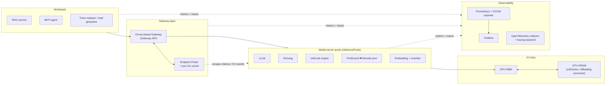
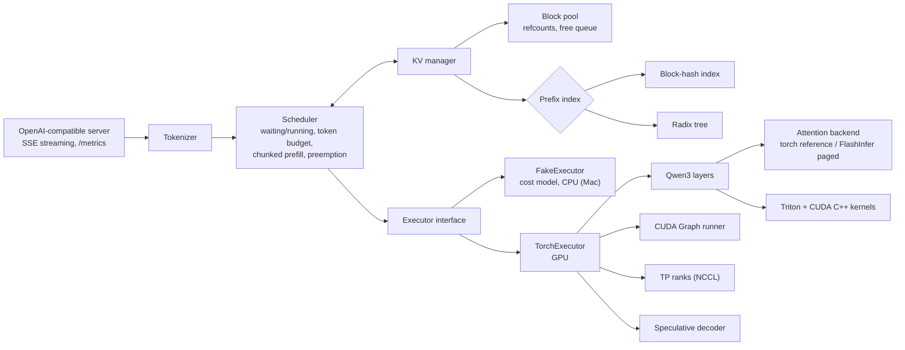

# InferLab — Revised Project Plan (v2)

> **One project, three layers:** a from-scratch LLM inference engine → a Kubernetes serving platform running vLLM, SGLang and your engine → RAG and agent workloads whose traces drive every benchmark.

| | |
|---|---|
| **Date** | 2026-09-27 (course-aligned learning track added 2026-09-28) |
| **Supersedes** | `deep-research-report.md`, `deep-research-report-2.md`, and the `.docx` (the `.docx` is a copy of the first report) |
| **Ecosystem snapshot** | vLLM v0.30.0 (2026-09-22) · SGLang v0.5.20 (2026-09-18) · llm-d v0.9.0 · Gateway API Inference Extension v1.6.2 · MCP spec 2026-07-28. Re-check before you pin versions. |
| **How to use it** | §0 is the one-page summary. §6 is the concept catalog (PagedAttention, RadixAttention, …): read the relevant card before each build step. §7 maps each phase to lectures, slides and homework from CMU, Stanford and MIT courses. §8 is the step-by-step plan with checkboxes, a Definition of Done and a résumé gate per phase. |

---

## Contents

0. [Summary](#0-summary)
1. [Review of the previous reports](#1-review-of-the-previous-reports)
2. [Assumptions and trade-offs](#2-assumptions-and-trade-offs)
3. [Target roles and skill coverage](#3-target-roles-and-skill-coverage)
4. [Architecture](#4-architecture)
5. [Hardware, models and budget](#5-hardware-models-and-budget)
6. [Core concepts: PagedAttention, RadixAttention and the rest](#6-core-concepts-pagedattention-radixattention-and-the-rest)
7. [Course-aligned learning track](#7-course-aligned-learning-track)
8. [Step-by-step plan](#8-step-by-step-plan)
9. [Electives](#9-electives)
10. [Benchmark and evaluation methodology](#10-benchmark-and-evaluation-methodology)
11. [Code-reading map](#11-code-reading-map)
12. [Reading list by phase](#12-reading-list-by-phase)
13. [Résumé, website and portfolio](#13-résumé-website-and-portfolio)
14. [Interview readiness checklist](#14-interview-readiness-checklist)
15. [Risks and mitigations](#15-risks-and-mitigations)
16. [Sources](#16-sources)

---

## 0. Summary

### The project in one paragraph

One repository, three layers, one measurement harness:

1. **Engine — build it.** A from-scratch runtime for Qwen3 dense models: paged KV cache read by a paged-attention backend, continuous batching with chunked prefill and preemption, vLLM-style block-hash prefix caching *and* SGLang-style radix-tree caching, CUDA Graphs, a Triton kernel and a CUDA C++ kernel, speculative decoding, tensor parallelism, and an OpenAI-compatible server that exposes the same metrics as vLLM so a production gateway can route to it.
2. **Platform — operate it.** A Kubernetes serving stack that runs vLLM, SGLang and your engine behind the Gateway API Inference Extension, with prefix-cache-aware routing (including a scorer plugin you write in Go), autoscaling on inference signals, KV-cache offloading, prefill/decode disaggregation, multi-LoRA, failure handling, and Prometheus/Grafana/OpenTelemetry observability.
3. **Workloads — use it.** A RAG service and an MCP tool-using agent running on the platform. Their recorded traces become the benchmark workloads that decide what to optimize.

### Why this shape

2026 AI-infra postings split into **engine/runtime** roles (scheduling, batching, KV-cache management, kernels) and **serving-platform** roles (Kubernetes, routing, autoscaling, disaggregated serving, SLOs, cost per token). The previous reports covered only the first. RAG and agents are included as **workloads that stress the infrastructure**. An infra hiring manager learns little from another chatbot demo, but a lot from "agent traces showed that prefix-aware routing cut per-turn p95 TTFT by X%."

### Phases

| Phase | Weeks (calendar if you start Oct 5, 2026) | What you do | Résumé checkpoint |
|---|---|---|---|
| 0 | Week 0 (Sep 28 – Oct 4) | Repo, CI, Mac dev environment, scripted GPU sprints | — |
| 1 | 1–3 (Oct 5 – Oct 25) | Measurement harness; operate, tune and profile vLLM and SGLang | **CP1** benchmarking + tuning study |
| 2 | 4–5 (Oct 26 – Nov 8) | RAG service + MCP agent; trace capture and replay | **CP1+** RAG and agent on self-hosted inference |
| 3 | 6–11 (Nov 9 – Dec 20) | Mini engine from scratch | **CP2** engine internals (strongest single signal) |
| 4 | 12–15 (Dec 21 – Jan 17) | Kubernetes serving platform | **CP3** platform |
| 5 | 16–17 (Jan 18 – Jan 31) | Agentic + RAG serving study across engines, routers and KV tiers | **CP4** capstone experiment |
| 6 | 18–21 (Feb 1 – Feb 28) | Speculative decoding, quantization, TP, MoE/EP, P/D disaggregation | **CP5** frontier + distributed |
| 7 | 22–24 (Mar 1 – Mar 21) | Regression CI, final report, website, upstream PRs | Final |
| Electives | any time | Kernels, RL-rollout infra, hybrid attention, multimodal, TPU/Apple, Rust router | optional |

**Pace:** 15–20 h/week. Full-time roughly halves each duration. Add ~2 buffer weeks for finals and holidays (weeks 10–13 overlap both). Course warm-ups are absorbed into the phases, not added on top (§7.3).
**Budget:** roughly $130–400 of rented GPU time, or close to zero with a university or NSF ACCESS allocation (§5).

### What changed from the previous reports

| # | Change | Why |
|---|---|---|
| 1 | Added the platform layer: Kubernetes, gateway routing, autoscaling, reliability | Anthropic, Red Hat, Fluidstack and similar postings center on it (§3.1) |
| 2 | Added RAG and agent workloads, used as benchmark drivers | You asked for them, and 2026 serving research centers on agentic traffic |
| 3 | Updated to the September-2026 ecosystem | Model Runner V2 is vLLM's default (v0.29); llm-d is a CNCF project; KV offloading; MoE/EP; EAGLE-3 → DFlash; FP8/NVFP4; hybrid-attention models; MCP went stateless |
| 4 | Re-sequenced for early résumé value | The old plans had nothing résumé-ready before week 14 |
| 5 | Mac-first development plus scripted GPU sprints | You have an M4 MacBook (16 GB) and no NVIDIA GPU |
| 6 | "Build the fundamentals, operate the frontier" | Building P/D, EP and FP8 kernels from scratch on rented consumer GPUs teaches less than operating the real systems |
| 7 | Added Go (gateway plugin) and CUDA C++ | Postings ask for Go (Kubernetes), Rust (routers), C++ (NVIDIA) |
| 8 | Added the concept catalog (§6) | PagedAttention, RadixAttention and the rest, each mapped to paper → code → build → proof → interview questions |
| 9 | Added quality evaluation and cost metrics | Speed without quality or $/token is not a platform result |
| 10 | Added a course-aligned learning track (§7) | CMU 15-442 and 15-779, Stanford CS336 and CS149, and MIT 6.S894 and 6.5940 supply the learning order, homework warm-ups and a proven project process |

---

## 1. Review of the previous reports

### Keep (these were right)

- **Build the mechanisms yourself.** Treat nano-vLLM and Mini-SGLang as textbooks and vLLM and SGLang as references and baselines. Never fork.
- **Every optimization behind an ablation switch.** One clean ablation beats a feature list.
- **A strict measurement contract:** TTFT, TPOT/ITL, E2E, goodput; full metadata; warmups; repetitions; profiling runs kept separate from headline runs.
- **Correctness invariants after every change:** greedy-output equivalence and allocator property tests.
- **Keep the concepts separate:** paged KV (allocation) ≠ paged-attention kernel (reading through block tables) ≠ prefix caching (reuse) ≠ radix tree (one way to index reuse).
- **Gate the résumé:** a keyword goes on only after code, a test, a benchmark and a write-up exist.
- **Reading order:** nano-vLLM → Mini-SGLang → vLLM → SGLang, with pinned commits.
- **Distillation is not core.** Its modern, relevant form is training a speculative drafter, which is now an optional step using SpecForge.

### Fix

| Issue in the previous reports | Fix in v2 |
|---|---|
| Scope ends at a single-node engine; no fleet layer | Phase 4 platform |
| No RAG, no agents | Phases 2 and 5 |
| Linear 14–32-week plans; first résumé value at week 14 | CP1 at week 3, then a checkpoint every 2–6 weeks |
| Assumed a local 8–24 GB NVIDIA GPU | Mac-first development plus GPU sprints (§5) |
| SOTA gaps: MoE/EP, KV offloading, production P/D frameworks, EAGLE-3/MTP/DFlash, FP8/NVFP4, hybrid attention, structured outputs, KV-aware routing, agentic workloads, RL rollouts | §6 catalog, Phases 4–6, electives |
| P/D, TP, quantization and speculative decoding all built from scratch | Build the fundamentals, operate the frontier, and write small from-scratch micro-benchmarks where they teach something |
| Python only | Go EPP plugin, CUDA C++ kernel, optional Rust router |
| Quality measured only loosely, only for quantization | lm-eval-harness gates plus RAG and agent task evals |
| No cost metrics | $/1M tokens, tokens/s/GPU and GPU-hours in every report |
| No website or portfolio plan | §13 |

---

## 2. Assumptions and trade-offs

### Assumptions (correct any that are wrong; each one changes the plan)

- **A1.** You are applying to 2027 new-grad or early-career AI-infra SDE roles now, so résumé-ready artifacts matter early.
- **A2.** You have 15–20 hours per week, starting in early October 2026.
- **A3.** Hardware is an M4 MacBook with 16 GB and no local NVIDIA GPU. All GPU work runs on rented or university GPUs.
- **A4.** Target mix: engine/runtime and serving-platform roles first, GPU-kernel roles second, applied-AI roles third.
- **A5.** Background, taken from the earlier reports: Amazon (containerized GPU workflows, AWS CDK in TypeScript), Huawei (VLM training and inference), PennCloud (distributed KV store), PennOS (operating system).

### Trade-offs and recommendations

| Decision | Options | Recommendation and why |
|---|---|---|
| Depth vs breadth | Engine only (old plan) / platform only / both | **Both, weighted.** The engine core is the non-negotiable depth and the platform is the non-negotiable breadth. Cut Phase 6 and the electives first. |
| Build vs operate | Build P/D, EP and FP8 kernels yourself / operate vLLM, SGLang, llm-d | **Build the fundamentals** (paging, scheduling, caching, graphs, one kernel, speculative decoding, TP=2). **Operate the frontier**, and write from-scratch micro-benchmarks for the parts you operate (for example, KV-transfer cost). |
| Router | Configure llm-d only / write a Go scorer plugin for the endpoint picker / write a standalone Rust router | **Go plugin.** It sits in the real production path, can be upstreamed, and adds Go. The Rust router (elective E6) is the alternative if you target Rust-heavy teams. |
| Engine model | Qwen3 dense (full-attention GQA) / Qwen3.5 (hybrid Gated DeltaNet + full attention) | **Qwen3 dense for your engine:** a clean KV-cache story, and both textbooks use it. Use Qwen3.5 in the production-engine experiments and as elective E3. |
| Kubernetes environment | kind locally / single-node k3s on a rented multi-GPU box / managed GKE or EKS | **kind plus a GPU-free simulator for development; single-node k3s on a rented 2–4-GPU box for measurements.** Use managed Kubernetes only if you have credits. |
| Agent framework | LangGraph and similar / thin custom loop plus the MCP SDK | **Thin loop.** Traces need exact control over requests, prefixes and timing. Know the frameworks; don't depend on them. |

### Cut order if you fall behind (cut from the top)

1. Electives
2. MoE / expert parallelism
3. P/D disaggregation (keep the KV-transfer micro-benchmark)
4. Tensor parallelism in your own engine
5. Autoscaling (keep routing)
6. The CUDA C++ kernel (keep the Triton kernel)

**Never cut:** the measurement harness, the engine core (paged KV, continuous batching, chunked prefill, both prefix caches), one routing experiment, the RAG/agent trace study, and the write-ups.

---

## 3. Target roles and skill coverage

### 3.1 What current postings ask for

| Role family | Example posting (seen September 2026) | What it emphasizes |
|---|---|---|
| Engine / runtime | OpenAI, *Software Engineer, Model Runtime* | Scheduling, continuous batching, memory management, KV-cache management, execution orchestration |
| Serving platform | Anthropic, *Staff + Senior Software Engineer, Inference* | Request routing, load balancing, traffic management, autoscaling, deployment pipelines, "LLM inference optimization, batching, and caching strategies", Kubernetes, Python or Rust |
| Serving platform (open source) | Red Hat, *Forward Deployed Engineer, AI Inference (vLLM and Kubernetes)* | Deploy llm-d and vLLM on Kubernetes, disaggregated serving, KV-cache routing, benchmarking and tuning to SLOs, Python and Go, Helm/Terraform, Envoy / Inference Gateway, AWQ/GPTQ, speculative decoding |
| Inference platform (GPU cloud) | Fluidstack, *Software Engineer, Inference Platform* | TTFT and cost per token, KV-cache infrastructure, disaggregated P/D, vLLM/SGLang/TRT-LLM, Kubernetes autoscaling, TP/PP/EP, NCCL, CUDA/Triton/torch.compile, FP8 via llm-compressor, open-source contributions |
| GPU performance (new grad) | NVIDIA, *AI Inference Performance Engineer – New College Grad 2026* and similar | C++/Python, CUDA or Triton kernels, experience with TRT-LLM/vLLM/SGLang, CS fundamentals |
| Rising: RL / post-training infra | SGLang with Miles, slime or verl | Inference engines as rollout backends: fast weight sync, determinism, rollout throughput |

Industry context: vLLM's creators launched **Inferact** (January 2026) and SGLang's team launched **RadixArk** (May 2026). Both are hiring for exactly these skills and both reward upstream contributions.

### 3.2 Coverage matrix

Claim levels: **Built** means you wrote it. **Operated** means you deployed, tuned, measured and debugged it. **Studied** means you read the code and can explain it.

| Skill | Phase | Evidence artifact | Claim |
|---|---|---|---|
| KV-cache memory math (MHA/GQA/MLA) | 3 | `kv_calculator.py` + predicted-vs-measured memory plot | Built |
| Paged KV cache / PagedAttention | 3 | Block pool, block tables, paged-attention backend, property tests | Built |
| Continuous batching, chunked prefill, preemption | 3 | Scheduler + static-vs-continuous and chunk-size plots | Built |
| Prefix caching: block-hash and RadixAttention (radix tree) | 3 | Both indexes + comparison report | Built |
| CUDA Graphs, overlap scheduling | 3 | Eager-vs-graph Nsight traces | Built |
| FlashAttention / FlashInfer | 3 | Backend integration + shape sweep | Integrated |
| Triton and CUDA C++ kernels | 3 (+E1) | Kernels, tests, bandwidth plots | Built |
| Speculative decoding (draft-target, n-gram; EAGLE-3/MTP/DFlash) | 6 | Own implementation + production sweep vs QPS | Built + Operated |
| Quantization (INT8 reference; FP8, W4A16, FP8 KV cache) | 6 | Quantizer + LLM Compressor checkpoints + quality/latency Pareto | Built + Operated |
| Structured outputs and tool-call parsing | 1, 2, 5 | Overhead measurements; agent uses JSON-schema outputs | Operated |
| Tensor parallelism + NCCL | 6 | TP=2 in your engine + communication profile | Built |
| MoE, expert parallelism, DP-attention | 6 | vLLM/SGLang MoE runs; TP vs EP comparison | Operated |
| P/D disaggregation + KV transfer (NIXL/Mooncake) | 6 | 1P1D-vs-colocated study + transfer micro-benchmark | Operated + Built |
| KV offloading / tiered caches (LMCache, HiCache, offloading connector) | 4, 5 | Multi-turn TTFT with and without a CPU tier | Operated |
| Multi-LoRA serving | 4 | Dynamic adapters + adapter-aware routing | Operated |
| Kubernetes GPU serving (GPU Operator, Helm/Kustomize, DRA awareness) | 4 | Manifests, runbook | Operated |
| Gateway API Inference Extension / llm-d router | 4 | InferencePool + endpoint-picker config + your Go scorer | Operated + Built |
| KV/prefix-aware routing, load balancing, session affinity | 4, 5 | Round-robin vs load-aware vs prefix-aware results | Built |
| Autoscaling on inference signals | 4 | KEDA/HPA policy + scale-up latency measurement | Built |
| Reliability: drain, retries, cancellation, rate limits, chaos | 4 | Failure-injection report | Built |
| Observability: Prometheus, Grafana, DCGM, OpenTelemetry | 1, 4 | Dashboards, traces | Built |
| Benchmarking, trace replay, regression CI | 1, 5, 7 | Harness, trace format, CI job | Built |
| Cost modeling ($/1M tokens, goodput per dollar) | 1, 5 | Cost tables in every report | Built |
| RAG: chunking, embeddings, reranking, vector DB, hybrid search, eval | 2 | RAG service + eval set | Built |
| Agents: tool calling, MCP servers and clients, sandboxing, tracing, eval | 2 | Agent + MCP servers + eval | Built |
| Languages | all | Python everywhere, Go (EPP plugin), C++/CUDA (kernel), Rust (optional) | Built |

---

## 4. Architecture

### 4.1 System view



### 4.2 Engine view



### 4.3 Repository layout

```text
inferlab/
├── engine/                   # Layer 1: from-scratch runtime (Python + Triton + CUDA C++)
│   ├── model/                # Qwen3 dense: layers, weight loader, sampler
│   ├── kv/                   # contiguous, block_pool, block_table, hash_prefix, radix
│   ├── scheduler/            # static, continuous, chunked prefill, preemption, policies
│   ├── executor/             # FakeExecutor (CPU cost model), TorchExecutor, CUDA graphs, TP
│   ├── attention/            # torch reference, FlashInfer / flash-attn paged backends
│   ├── kernels/              # triton/ (rmsnorm, swiglu), cuda/ (one kernel + torch extension)
│   ├── spec/                 # draft-target, n-gram
│   ├── quant/                # INT8 reference quantizer
│   └── server/               # OpenAI-compatible API, SSE streaming, /metrics
├── platform/                 # Layer 2: Kubernetes
│   ├── kind/                 # local cluster + llm-d-inference-sim
│   ├── deploy/               # Helm values / Kustomize for vLLM, SGLang, InferLab, embeddings
│   ├── gateway/              # Gateway + InferencePool + endpoint-picker config
│   ├── epp-scorer/           # your Go scorer plugin
│   ├── autoscaling/          # KEDA / HPA configs
│   └── observability/        # Prometheus rules, Grafana dashboards, OTel collector
├── apps/                     # Layer 3: workloads
│   ├── rag/                  # ingest, embed, retrieve, rerank, generate, eval
│   ├── agent/                # agent loop, MCP servers (docs_search, sql, python_sandbox), eval
│   └── traces/               # recorded traces (JSONL) and replay spec
├── bench/                    # load generator, trace replay, metrics, SLO/goodput, cost, plots
├── infra/                    # GPU sprint scripts (provision/bootstrap/run/collect/teardown), Dockerfiles
├── docs/                     # architecture, design notes, experiment reports, reading notes, runbooks
├── references.lock           # pinned tags/commits: vLLM, SGLang, nano-vLLM, Mini-SGLang, llm-d, GIE
└── tests/
```

### 4.4 Interfaces that keep the layers decoupled

1. **OpenAI-compatible HTTP everywhere** (`/v1/chat/completions`, `/v1/completions`, streaming). Apps, benchmarks and the gateway never import engine code, so every engine is swappable.
2. **Your engine implements the Gateway API Inference Extension model-server protocol.** The endpoint picker requires queue length, running requests and KV-cache utilization. vLLM exposes these as `vllm:num_requests_waiting`, `vllm:num_requests_running` and `vllm:kv_cache_usage_perc`; SGLang as `sglang:num_queue_reqs`, `sglang:num_running_reqs` and `sglang:token_usage`. Export the vLLM names from InferLab and it becomes a first-class backend in a production gateway, which makes a strong résumé line.
3. **`Executor` protocol:** `execute(batch: ScheduledBatch) -> StepOutput`. `FakeExecutor` sleeps according to a calibrated cost model (prefill cost grows with tokens; decode cost with batch size and KV read). This lets you build and test the scheduler, allocator and caches on the Mac and run discrete-event simulations before touching a GPU.
4. **Trace format (JSONL), one record per LLM call:** `session_id`, `turn`, `parent_call`, arrival offset, full message content, prompt and output token counts, tool latency before the call, SLO class. Replay sends the same content (so prefix sharing is preserved) and forces output length with `max_tokens` plus `ignore_eos`, which makes nondeterministic agent runs reproducible.
5. **Result schema (JSON or Parquet):** raw per-request timings plus run metadata (git commit, model and revision, GPU, driver, CUDA, PyTorch, engine version and flags, seed, warmup, repetitions, topology).

---

## 5. Hardware, models and budget

### 5.1 Your Mac (M4, 16 GB) is the development machine

**Use it for:**
- Scheduler, block allocator, radix tree and router logic with `FakeExecutor`; unit and property tests; discrete-event simulations.
- Kubernetes: a `kind` cluster running `llm-d-inference-sim`, a GPU-free, OpenAI-compatible vLLM simulator, to build routing, autoscaling and dashboards. Give Docker Desktop 6–8 GB.
- RAG and agent development against a small local model through **`vllm-metal`** (the vLLM project's community-maintained Apple Silicon plugin, with paged KV, prefix caching and the OpenAI server) or `mlx-lm`. Use a 2B–4B model at 4-bit; 16 GB won't hold more alongside the OS, Docker and a vector database.
- Writing, plotting and reading code.

**Don't use it for:** headline benchmarks, CUDA, Triton, FlashInfer or NCCL. Never publish Mac numbers as serving results.

### 5.2 GPU sprints

Prepare everything locally, then rent, run a scripted sprint, pull results, and destroy the machine.

1. `infra/provision.sh` creates the instance through the provider's CLI or API.
2. `infra/bootstrap.sh` checks the driver, installs Docker and the NVIDIA Container Toolkit, mounts a persistent Hugging Face cache, and pulls pinned images.
3. `make sprint-<phase>` runs the phase's experiments.
4. `infra/collect.sh` copies results back, plus `nvidia-smi -q` and `nvidia-smi topo -m`.
5. Tear down.

Target: under 15 minutes from "rent" to "first benchmark running." Set a spend alert, and use spot or interruptible instances for anything restartable.

**Where to get GPUs, cheapest first:** Penn lab, course or HPC allocations → NSF ACCESS (Anvil AI has H100s; graduate students are eligible) → cloud research credits (AWS Cloud Credit for Research accepts graduate students) → marketplace clouds for RTX 4090 / L40S-class GPUs → on-demand clouds. For reference, the earlier report listed Lambda on-demand prices as of 2026-08-31: A10 24 GB $1.29/h, A6000 48 GB $1.09/h, A100 40 GB $1.99/h, H100 PCIe $3.29/h.

### 5.3 GPU needs and rough cost by phase

| Phase | GPU | Why this GPU | GPU-hours | Est. cost |
|---|---|---|---|---|
| 1 | 1× 24–48 GB Ada or Hopper (L4, L40S, RTX 4090, A6000; one H100 session) | FP8 needs Ada or Hopper | 15–25 | $15–50 |
| 2 | none (Mac) | — | 0–5 | $0–5 |
| 3 | 1× 24 GB, Ampere or newer (RTX 4090, L4, A10) | FlashInfer/flash-attn/Triton need SM80+; use Qwen3-0.6B to 4B | 30–50 | $20–70 |
| 4 | one node with 2–4 GPUs | Several replicas for routing and autoscaling | 10–20 | $25–80 |
| 5 | one node with 2–4 GPUs | Trace replay across stacks | 10–20 | $25–80 |
| 6 | 1× H100 (FP8, EAGLE-3, MoE) + one 2-GPU node (TP, P/D) | Hopper features and multi-GPU | 15–25 | $40–100 |
| 7 | short nightly runs on 1× 24 GB | Regression CI | ~10 | $5–20 |
| **Total** | | | **~90–155** | **~$130–400** |

### 5.4 Models (verify availability when you start)

| Use | Model | Why |
|---|---|---|
| Engine correctness and development | Qwen3-0.6B | Full-attention GQA; nano-vLLM and Mini-SGLang use it; small and fast |
| Engine performance | Qwen3-1.7B / 4B (8B on ≥ 40 GB) | Decode becomes meaningfully bandwidth-bound |
| Production engines, dense | Qwen3-8B | Same family as your engine, so comparisons are apples to apples |
| Production engines, current architecture | Qwen3.5-9B (Gated DeltaNet linear attention and full attention, 3:1) | Shows how hybrid recurrent state changes caching |
| MoE | Qwen3-30B-A3B or gpt-oss-20b | Expert parallelism and DP-attention on 1–2 GPUs |
| Speculative draft | Qwen3-0.6B for Qwen3-8B; an EAGLE-3 or DFlash drafter if one is published for your target | Same tokenizer |
| Embeddings / reranker | Qwen3-Embedding-0.6B, Qwen3-Reranker-0.6B (or the current MTEB leaders) | Served by vLLM's pooling runner |
| Local Mac development | Qwen3.5-2B or 4B, 4-bit | Fits in 16 GB |

**KV numbers to memorize (BF16, computed from the Hugging Face configs):**

| Model | Layers × KV heads × head dim | KV per token | One 32K-token sequence |
|---|---|---|---|
| Qwen3-0.6B | 28 × 8 × 128 | 112 KiB | 3.5 GiB, about 3× the model's own ~1.2 GB of weights |
| Qwen3-8B | 36 × 8 × 128 | 144 KiB | 4.5 GiB |

KV size scales with layers × KV heads × head dim, not with parameter count. That is why a "tiny" model can still run out of KV memory, and why memory management is a first-class serving problem.

---

## 6. Core concepts: PagedAttention, RadixAttention and the rest

Each card follows the same shape: **Idea → Sources → Read in code → Build → Prove → Interview checks → Misconception.** The bracket after the title says where in §8 you build it. Paths were checked on 2026-09-27; pin the commit you actually read in `references.lock`.

### 6.1 Four terms people confuse

| Term | The question it answers | Where it lives |
|---|---|---|
| **Paged KV cache** | Where is this request's K/V stored, and which physical blocks does it own or share? | Allocator: block pool + block tables |
| **PagedAttention** (kernel side) | How does attention read K/V correctly and quickly through that indirection? | Attention backend (FlashAttention / FlashInfer paged kernels) |
| **Prefix caching** | Has another request already computed a prefix this one can reuse? | Prefix index: block-hash map (vLLM) or radix tree (SGLang) |
| **RadixAttention** | How do I index, share, schedule around and evict reusable prefixes? | SGLang's radix cache + cache-aware scheduling |

Mixing these up is the most common red flag in inference interviews. Keep them as separate modules in your code too.

### 6.2 KV cache fundamentals [Step 3.1]

- **Idea.** Autoregressive decoding needs every previous token's keys and values. Caching them turns each decode step into one token of compute plus a read of the entire cache, which is why decode is memory-bandwidth-bound while prefill is compute-bound. KV bytes = 2 × layers × KV heads × head dim × bytes per element × tokens. GQA/MQA shrink KV heads, MLA (DeepSeek) caches a compressed latent instead of full K/V, and an FP8 KV cache halves the bytes.
- **Sources.** Hugging Face Transformers cache docs and `cache_utils.py` (DynamicCache, StaticCache, QuantizedCache); DeepSeek-V2/V3 papers for MLA.
- **Build.** `kv_calculator.py` that reads any `config.json`; a contiguous per-request KV cache as the baseline.
- **Prove.** Predicted vs measured memory across context lengths; tokens/s with the cache on and off.
- **Interview checks.** Derive Qwen3-8B's KV for 32K tokens (§5.4). Why does GQA cut KV memory but barely change FLOPs? Why is decode memory-bound? Explain it with arithmetic intensity.

### 6.3 PagedAttention and the paged KV cache [Step 3.2; kernel side Step 3.5]

- **Idea.** Reserving contiguous KV memory per request wastes it in three ways: slots reserved for future tokens, internal fragmentation, and external fragmentation. The vLLM paper measured that existing systems used only **20.4–38.2%** of KV memory for actual token states. vLLM borrows virtual memory from operating systems. KV lives in fixed-size blocks (for example, 16 tokens) drawn from one physical pool, and a per-request **block table** maps logical block *i* to a physical block. Blocks are allocated on demand and freed at completion, so waste is limited to one partially filled block per request ("near-zero waste"). Reference counts plus copy-on-write let parallel samples and beam candidates share blocks.
- **The two halves.** (1) Memory management: block pool, block tables, and a **slot mapping** (token → physical slot) used to *write* new K/V. (2) The attention kernel that *reads* K/V through the block table. The paper reports that this indirection made its attention kernel 20–26% slower than FasterTransformer's, a cost repaid many times over by larger batches. On NVIDIA GPUs the original 2023 kernel is now largely superseded by FlashAttention and FlashInfer kernels that accept block tables. The memory-management idea is what persists.
- **Sources.** Kwon et al., *Efficient Memory Management for Large Language Model Serving with PagedAttention*, SOSP 2023 (arXiv 2309.06180).
- **Read in code.**
  - nano-vLLM: `nanovllm/engine/block_manager.py`, `sequence.py`, `model_runner.py` (`prepare_prefill` and `prepare_decode` build `slot_mapping` and `block_tables`), `nanovllm/layers/attention.py`.
  - vLLM: `vllm/v1/core/block_pool.py` (`KVCacheBlock` with a ref count and linked-list pointers; the free-block queue), `vllm/v1/core/kv_cache_manager.py` (scheduler-facing `get_computed_blocks`, `allocate_slots`, `free`), `vllm/v1/core/kv_cache_coordinator.py` (several KV groups, for example full attention + sliding window + hybrid state).
- **Build.** `Block`, `BlockPool` (free list, ref counts), `BlockTable`, slot-mapping construction, the KV write path, a pure-PyTorch reference attention that gathers blocks (for correctness), then FlashInfer or flash-attn with block tables (for speed).
- **Prove.** Maximum concurrency at fixed memory, contiguous vs paged; a block-size sweep (8/16/32/64) against waste and decode latency; randomized property tests (pages conserved, no double free, ref count ≥ 0, no leak after preemption); greedy output identical for contiguous and paged.
- **Interview checks.** Internal vs external fragmentation? The block-size trade-off (waste and sharing granularity vs metadata and kernel efficiency)? How does copy-on-write work for parallel sampling? What does the kernel need besides the block table (context lengths, slot mapping)?
- **Misconception.** "PagedAttention" is not a synonym for "any KV optimization." **Résumé gate:** write "PagedAttention" only once your attention path reads through block tables (Step 3.5). A path that gathers blocks into contiguous memory before attention is a "paged KV cache."

### 6.4 Automatic prefix caching: block hashes (vLLM style) [Step 3.4]

- **Idea.** Name each *full* block by a hash of its parent block's hash, its own tokens, and extra keys. Equal prefixes then produce equal hash chains. Freed blocks stay cached in an evictable pool instead of being wiped. A new request walks its chain until the first miss, reuses the hits (ref count + 1), and computes only the rest.
- **Details from vLLM's design doc.** Only full blocks are cached. Extra keys include LoRA IDs, multimodal input hashes and a per-request `cache_salt`, which is injected into the first block's hash so only requests with the same salt share KV; this blocks timing side-channel attacks between tenants. Eviction is LRU over a doubly linked free queue built into the blocks, giving O(1) removal from the middle. A finished request's blocks join the queue tail in *reverse* order, because tail blocks hash more tokens and are less likely to be reused. Hash choices are `sha256` (default), `sha256_cbor`, `xxhash` and `xxhash_cbor`.
- **Sketch.**

  ```python
  def block_hashes(tokens, block_size, extra_keys):
      hashes, parent = [], None
      n_full = len(tokens) - len(tokens) % block_size          # full blocks only
      for start in range(0, n_full, block_size):
          parent = H((parent, tuple(tokens[start:start + block_size]), extra_keys))
          hashes.append(parent)
      return hashes

  def get_computed_blocks(req):
      hits = []
      for h in block_hashes(req.tokens, BLOCK, req.extra_keys):
          blk = cached_blocks.get(h)
          if blk is None:
              break
          blk.ref_cnt += 1; free_queue.remove_if_present(blk)  # O(1) with intrusive list
          hits.append(blk)
      return hits
  ```

- **Read in code.** vLLM's prefix-caching design doc and `vllm/v1/core/block_pool.py`; nano-vLLM `block_manager.py` for a compact version.
- **Build.** Chained hashing, lookup, LRU eviction through free-queue ordering, cache salt.
- **Prove.** A shared-prefix sweep (0/25/50/75/90%) plotting hit rate against TTFT. Adversarial tests: identical block contents under different parents must not match, and differently salted requests must not share. Outputs must be identical with caching on and off.
- **Interview checks.** Why must the parent hash be part of the key? What happens when the whole prompt hits? (You still need logits for the last position, so at least one token is recomputed.) What is the security risk of a shared prefix cache, and how does salting fix it?

### 6.5 RadixAttention: the radix-tree prefix cache (SGLang style) [Step 3.4]

- **Idea.** Keep the KV of past and in-flight requests in a **radix tree** (a compressed trie) keyed by token sequences. Each edge holds a token span plus the KV indices for it. A request does a longest-prefix match, reuses the matched KV, and inserts its new tokens afterward. When memory runs short, evict least-recently-used **leaves** whose lock count is zero. When a new sequence diverges in the middle of an edge, split the node.
- **Beyond the data structure.**
  1. *Cache-aware scheduling.* Ordering the waiting queue by matched-prefix length ("longest prefix match", LPM) raises hit rates, at some cost in fairness.
  2. *Cache-aware routing.* The SGLang Model Gateway (Rust) keeps an approximate prefix tree per worker and sends repeated prefixes to the worker likely to hold them, unless load imbalance crosses configurable thresholds.
  3. *Hierarchical caching.* SGLang's HiCache extends the tree to host memory and storage tiers.
- **Sketch.**

  ```python
  class RadixNode:
      children: dict[int, "RadixNode"]   # keyed by the first token of each child edge
      key: list[int]                     # token span on the edge into this node
      pages: list[int]                   # KV slot/page indices for `key`
      lock_ref: int                      # > 0 while an in-flight request uses this node
      last_access: float

  def match_prefix(root, tokens):
      node, i, pages = root, 0, []
      while i < len(tokens) and tokens[i] in node.children:
          child = node.children[tokens[i]]
          n = common_prefix_len(child.key, tokens[i:])
          if n < len(child.key):
              child = split(child, n)    # new upper node keeps key[:n] and pages[:n]
          pages += child.pages
          i += n
          node = child
      return node, pages                 # caller increments lock_ref along the path

  def evict(num_tokens):
      heap = [(n.last_access, n) for n in leaves() if n.lock_ref == 0]
      heapify(heap); freed = 0
      while freed < num_tokens and heap:
          _, leaf = heappop(heap)
          free_pages(leaf.pages); freed += len(leaf.pages)
          parent = detach(leaf)
          if parent is not root and not parent.children and parent.lock_ref == 0:
              heappush(heap, (parent.last_access, parent))
  ```

  With a page size above 1, matches are truncated to page boundaries.
- **Sources.** Zheng et al., *SGLang: Efficient Execution of Structured Language Model Programs*, NeurIPS 2024 (arXiv 2312.07104).
- **Read in code.**
  - Mini-SGLang: `python/minisgl/kvcache/radix_cache.py` (read all of it) and `python/minisgl/scheduler/cache.py` (how the radix index sits on top of page allocation).
  - SGLang: `python/sglang/srt/mem_cache/radix_cache.py`, `memory_pool.py`, `memory_pool_host.py`, `hicache_storage.py`, and the Rust tree in `rust_tree_core/`.
  - Routing: `sgl-model-gateway/` (cache-aware policy and its thresholds).
- **Build.** `RadixNode`, `match_prefix`, `insert`, `split`, `evict(n_tokens)` with a heap over evictable leaves, all integrated with your block pool's ref counts. Add the LPM scheduling policy behind a flag.
- **Prove.** Use workloads with tree-shaped sharing: multi-turn chat, agent sessions, few-shot prompts, and branching or self-consistency sampling. Measure hit rate, TTFT and lookup CPU time against the block-hash index, and compare LPM with FCFS on hit rate and p99 queue wait.
- **Hand exercise.** For the prompts `SYS+A+X`, `SYS+A+Y` and `SYS+B+Z`, draw the block-hash chains and the radix tree by hand. Then print both structures from your code and check that they match.
- **Interview checks.** Why a radix tree rather than a hash map? What does a page size above 1 do to match granularity? How do you avoid evicting a prefix an in-flight request is using? How can a router approximate this without seeing engine state?
- **Misconception.** RadixAttention is not an attention kernel and does not change the math. It is runtime cache organization plus scheduling.

### 6.6 Block hash vs radix tree

| Aspect | Block hash (vLLM) | Radix tree (SGLang) |
|---|---|---|
| Match granularity | Full blocks only | Tokens (page-aligned when page size > 1) |
| Lookup | One hash-map probe per block | Tree walk comparing tokens |
| Structure | Flat map + LRU free queue | Tree with node splits and per-node locks |
| Eviction unit | Free blocks (ref count 0), tail blocks first | Unlocked leaves, LRU |
| Natural fit | Shared system prompts, simple chains | Branching conversations, agents, program-like prompting |
| Scheduling synergy | FCFS / priority | Longest-prefix-first ordering |
| Fleet-level routing | llm-d indexes vLLM's KV events (block hashes) for precise prefix-aware routing | The SGLang gateway keeps an approximate tree per worker |
| Typical bugs | Missing extra keys (LoRA, salt) → wrong reuse; partial blocks | Lock/ref-count leaks; split bugs; evicting in-use nodes |

Write this comparison up with your own measurements in `docs/design/prefix-cache.md` (Step 3.4). It is one of the best interview stories in the project.

### 6.7 Continuous batching (iteration-level scheduling) [Step 3.3]

- **Idea.** Static batching waits for the longest request in the batch. Continuous batching re-forms the batch every iteration: finished requests leave and waiting requests join. This is Orca's iteration-level scheduling; Orca also introduced selective batching for operations that can't be batched across different lengths.
- **Sources.** Yu et al., *Orca: A Distributed Serving System for Transformer-Based Generative Models*, OSDI 2022.
- **Read in code.** nano-vLLM `scheduler.py` (whole file); Mini-SGLang `scheduler/scheduler.py`, `prefill.py`, `decode.py`; vLLM `vllm/v1/core/sched/scheduler.py`. vLLM V1's scheduler has no separate prefill and decode phases. Each request tracks computed tokens, and each step hands out a token budget so requests catch up. Explaining this unification is a good interview point.
- **Build.** Waiting and running queues, a token budget (`max_num_batched_tokens`), `max_num_seqs`, a decode-first policy, immediate backfill.
- **Prove.** Static vs continuous under Poisson arrivals with high length variance at concurrency 1–32: throughput and mean/p99 latency. Run it first in the discrete-event simulator on the Mac, then on the GPU, and compare prediction with reality; that comparison makes a good write-up.
- **Interview checks.** How does continuous batching differ from dynamic batching in classic model serving? What limits batch size: compute, KV memory, or the latency SLO?

### 6.8 Chunked prefill and stall-free scheduling [Step 3.3]

- **Idea.** A long prefill in the same iteration as ongoing decodes stalls them, so inter-token latency spikes. Splitting prefills into chunks under a per-iteration token budget and co-scheduling them with decodes removes the stall (Sarathi-Serve). The budget trades TTFT (bigger chunks) against ITL (smaller chunks).
- **Sources.** Agrawal et al., *Taming Throughput-Latency Tradeoff in LLM Inference with Sarathi-Serve*, OSDI 2024 (arXiv 2403.02310); vLLM's "Optimization and Tuning" docs.
- **Build.** Chunking under the token budget, decode-first packing, correct partial-prefill state.
- **Prove.** One 4–8K-token prompt arriving amid 16 active decodes, with chunk sizes 128/256/512/1024/off: the long request's TTFT, the others' p99 ITL, and total throughput. Correctness: chunked and unchunked outputs must be identical.
- **Interview checks.** Why does chunk size move TTFT and ITL in opposite directions? Why can chunking also lower peak activation memory?

### 6.9 Preemption: recompute vs swap [Step 3.3]

- **Idea.** When KV blocks run out, pick a victim and either free its blocks and recompute later (vLLM V1's approach) or swap them to CPU memory and bring them back. KV offloading (§6.19) turns "swap" into a tiered-cache question.
- **Build.** Victim selection (for example, latest arrival or lowest priority), the RUNNING → WAITING transition, the recompute path.
- **Prove.** A memory-pressure run: preemption count, wasted recompute tokens, p99 latency. Property test: no leaked blocks after any sequence of preemptions and resumptions.
- **Interview checks.** When is recompute cheaper than swapping? (Compare prefill time with PCIe transfer time for the same KV bytes.)

### 6.10 CPU overhead, CUDA Graphs and overlap scheduling [Step 3.5]

- **Idea.** Small-batch decode launches hundreds of tiny kernels, and Python plus launch overhead can exceed GPU time. CUDA Graphs capture a step once per padded batch-size bucket and replay it with a single launch. Overlap scheduling (SGLang's zero-overhead scheduler, vLLM's async scheduling) prepares batch N+1 on the CPU while the GPU runs batch N.
- **Read in code.** nano-vLLM `capture_cudagraph()` in `model_runner.py`; Mini-SGLang `python/minisgl/engine/graph.py`; vLLM Model Runner V2 at `vllm/v1/worker/gpu/model_runner.py` (the default since v0.29). vLLM supports *piecewise* graphs, where attention runs eagerly between captured pieces, and *full* graphs, where the whole step including attention is captured when the backend allows it.
- **Build.** Static input buffers (input IDs, positions, slot mapping, block tables, context lengths); capture buckets {1, 2, 4, 8, 16, 32, …}; pad each batch to the nearest bucket.
- **Prove.** Nsight Systems before and after at batch sizes 1/4/16/32; TPOT vs batch size; show the CPU gaps disappearing from the timeline.
- **Interview checks.** Why do graphs help decode more than prefill? What breaks capture (dynamic shapes, CPU synchronization, allocation)? What does padding to buckets cost?

### 6.11 FlashAttention, Flash-Decoding and FlashInfer [Step 3.5; elective E1]

- **Idea.** Exact attention computed in tiles held in on-chip SRAM with an online softmax, never materializing the N×N score matrix in HBM. That cuts memory traffic, not FLOPs. FlashAttention-2 improved parallelism and work partitioning, FlashAttention-3 uses Hopper asynchrony (TMA, warp specialization) and FP8, and FlashAttention-4 targets Blackwell. Decode has one query per sequence, so kernels split the KV along its length across thread blocks and then reduce (Flash-Decoding, or "split-KV"). FlashInfer provides paged and ragged KV attention with load-balanced scheduling and JIT specialization; both SGLang and vLLM use it.
- **Sources.** FlashAttention (arXiv 2205.14135), FlashAttention-2 (2307.08691), FlashAttention-3 (2407.08608); FlashInfer, MLSys 2025 (arXiv 2501.01005); Triton's `06-fused-attention.py` tutorial.
- **Build.** FlashInfer (or flash-attn with block tables) as your paged backend. Optional: your own Triton paged-decode kernel (E1).
- **Prove.** Prefill latency vs sequence length (128–8K) and decode latency vs context length and batch size, reference vs optimized. Explain where the speedup grows or shrinks.
- **Interview checks.** Why does FlashAttention reduce HBM traffic but not FLOPs? Why does decode need split-KV? Is FlashAttention approximate? (No, it is exact.)

### 6.12 Kernels: Triton, CUDA C++, fusion and the roofline [Step 3.5; elective E1]

- **Idea.** Many transformer operations are memory-bound, so fusing them (residual add + RMSNorm, SwiGLU) removes round-trips to HBM. The roofline model says a kernel is limited by the lower of peak FLOP/s and bandwidth × arithmetic intensity.
- **Build.** A Triton fused residual + RMSNorm and a SwiGLU kernel; the same RMSNorm in CUDA C++ as a PyTorch extension; compare all three against PyTorch eager and `torch.compile`.
- **Prove.** Correctness across shapes and dtypes; achieved bandwidth as a percentage of peak; p50/p95 kernel latency.
- **Interview checks.** Is RMSNorm compute-bound or memory-bound? What limits your kernel's achieved bandwidth (occupancy, coalescing, vector width)?

### 6.13 Speculative decoding [Step 6.1]

- **Idea.** A cheap proposer guesses *k* tokens, the target model verifies them in one forward pass, and a rejection-sampling rule keeps the output distribution exactly the target's. With per-token acceptance rate α, the expected number of tokens per target pass is (1 − α^(k+1)) / (1 − α). It spends extra compute to save sequential steps, so it helps most when decode is memory-bound (low batch or QPS) and can hurt under heavy load.
- **Proposer families in 2026.**
  - A separate small draft model.
  - N-gram / prompt lookup and suffix decoding, which are strong on agents and code because they repeat context.
  - Medusa heads.
  - EAGLE-3, a feature-level drafter and now the baseline.
  - MTP heads trained with the model (DeepSeek).
  - DFlash, a block-diffusion drafter shipped with SGLang's Spec V2 in June 2026.
  - SGLang's SpecForge trains drafters (v0.3, August 2026), and vLLM added adaptive verification and per-request acceptance statistics in 2026.
- **Sources.** Leviathan et al., *Fast Inference from Transformers via Speculative Decoding* (arXiv 2211.17192); Chen et al., speculative sampling (arXiv 2302.01318); EAGLE-3 (arXiv 2503.01840); LMSYS posts on DFlash/Spec V2 and SpecForge v0.3.
- **Build.** Draft-target and n-gram proposers in your engine, plus a rejection sampler unit-tested on toy distributions (the empirical output distribution must match the target) and a greedy exactness test.
- **Prove.** In vLLM and SGLang, EAGLE-3 (and MTP or DFlash where available) vs off across QPS: acceptance length, TPOT, throughput, and the QPS where speculation stops paying.
- **Interview checks.** Prove the output distribution is unchanged. Why does speculation lose at high batch sizes? Why do agent workloads favor n-gram and suffix proposers?

### 6.14 Quantization [Step 6.2]

- **Idea.** *Weight-only* quantization (W4A16, W8A16; GPTQ and AWQ, run in vLLM through Marlin-family kernels) shrinks weights and speeds up memory-bound decode, but dequantization overhead can hurt compute-bound prefill at large batch sizes. *Weight + activation* quantization (W8A8 in FP8 or INT8; SmoothQuant) uses low-precision tensor cores and helps compute-bound phases, if the hardware supports it: FP8 needs Ada or Hopper, and the NVFP4/MXFP4 microscaling formats need Blackwell. An FP8 KV cache doubles KV capacity. Always measure quality alongside speed.
- **Sources.** GPTQ (arXiv 2210.17323), AWQ (2306.00978), SmoothQuant (2211.10438); vLLM quantization docs; LLM Compressor.
- **Build.** A per-channel / group-wise INT8 weight quantizer: the reference math and a plot of error vs group size.
- **Operate.** Use LLM Compressor to produce FP8 (W8A8) and W4A16 checkpoints, serve them in vLLM and SGLang, turn on the FP8 KV cache, and score quality with lm-evaluation-harness on a fixed task set.
- **Prove.** A quality × memory × latency Pareto plot per format and batch size.
- **Interview checks.** Why can 4-bit be slower than FP16 at high batch sizes? What do per-channel and per-group scales trade off? What does an FP8 KV cache cost in accuracy?

### 6.15 Structured outputs and tool calling [Phases 1, 2, 5]

- **Idea.** Constrain decoding with a grammar: a JSON schema compiles to a pushdown automaton, and each step masks invalid tokens. XGrammar precomputes context-independent token masks to keep per-step overhead small, and SGLang's compressed finite-state machine can jump forward over forced tokens. Tool calling means the model emits a structured call, the server parses it with a model-specific parser, and the client executes it.
- **Operate and measure.** The overhead of JSON-schema outputs on TPOT and throughput; the tool-call parse failure rate by model; the effect of tool results on prefix reuse across agent turns.

### 6.16 Tensor parallelism and collectives [Step 6.3]

- **Idea (Megatron style).** Split QKV and the MLP up/gate projections by columns, and the attention output and MLP down projections by rows. Each transformer layer then needs two all-reduces: after attention and after the MLP. All-reduce volume per layer is roughly hidden size × tokens × bytes per element, so the interconnect decides whether TP helps; NVLink and PCIe give different answers.
- **Read in code.** nano-vLLM `nanovllm/layers/linear.py` (column-, row- and QKV-parallel linears); Mini-SGLang `python/minisgl/layers/`; NCCL collectives docs.
- **Build.** TP=2 in your engine with `torch.distributed` and NCCL; sharded weight loading; rank-local KV.
- **Prove.** TP=1 vs 2: latency, throughput, memory per GPU, and communication time from Nsight or NCCL traces. Record `nvidia-smi topo -m`.
- **Interview checks.** Where exactly are the all-reduces? Why can TP=2 be slower for a small model? When would you choose TP, PP or DP for serving?

### 6.17 MoE, expert parallelism and DP-attention [Step 6.3]

- **Idea.** MoE layers route each token to its top-k experts. Expert parallelism places experts on different GPUs and moves tokens with all-to-all dispatch and combine (DeepEP kernels). Attention often runs data-parallel (DP-attention) so KV isn't duplicated across TP ranks, and EPLB rebalances hot experts with redundant copies. Wide EP across many GPUs is how DeepSeek- and Kimi-class models are served.
- **Operate.** Qwen3-30B-A3B or gpt-oss-20b in vLLM and SGLang: TP=2 vs EP=2 (with DP-attention) on 2 GPUs. Read llm-d's wide-EP guide and SGLang's large-scale EP blog posts.
- **Interview checks.** How does MoE change the prefill/decode bottleneck? What does the all-to-all cost? Why pair DP-attention with EP?

### 6.18 Prefill/decode disaggregation and KV transfer [Step 6.4]

- **Idea.** Prefill (compute-bound) and decode (bandwidth-bound) interfere when they share GPUs. Separate pools remove the interference and let you size each pool for its SLO (TTFT vs ITL), at the cost of moving KV (KV bytes per token × prompt length) between GPUs. It is not a free throughput win: vLLM's documentation frames disaggregated prefill mainly as a way to control tail ITL and TTFT separately.
- **Sources.** DistServe, OSDI 2024 (arXiv 2401.09670); Splitwise, ISCA 2024 (arXiv 2311.18677); Mooncake, FAST 2025 (arXiv 2407.00079).
- **Read in code.** vLLM `vllm/distributed/kv_transfer/kv_connector/v1/` (`nixl/`, `mooncake/`, `lmcache_connector.py`); SGLang `python/sglang/srt/disaggregation/`; NVIDIA Dynamo's disaggregated-serving design docs.
- **Operate.** vLLM with the NIXL connector (or SGLang PD with Mooncake or NIXL) as one prefill and one decode worker on a 2-GPU node, behind a P/D-aware router (SGLang Model Gateway, llm-d or Dynamo).
- **Build.** A from-scratch KV-transfer micro-benchmark: send a tensor the size of a real KV cache over NCCL or P2P and compute the break-even prompt length.
- **Prove.** Colocated vs 1P1D under a prefill-heavy (RAG) mix and a decode-heavy (chat) mix: TTFT, p99 ITL, goodput under SLO, transfer time. A negative result is a valid result if you explain it.
- **Interview checks.** When does disaggregation pay off? How do you choose the P:D ratio? What does the router need to know?

### 6.19 KV offloading and tiered caches [Step 4.3; Phase 5]

- **Idea.** GPU HBM holds only the hottest KV. Offloading to CPU DRAM (and to disk or remote storage) lets a finished or paused session resume without recomputing its prefill; restoring wins whenever transfer time is lower than recompute time. Agents make this central, because a tool call pauses a session for seconds and its KV can be evicted in the meantime. Continuum (ICLR 2026) pins multi-turn agent KV with a time-to-live for exactly this reason.
- **Operate.** vLLM with LMCache (or vLLM's native offloading connector); SGLang HiCache; llm-d's tiered-KV guide.
- **Prove.** Replay multi-turn agent traces with GPU KV deliberately undersized, and measure per-turn TTFT and hit rate with and without the CPU tier.
- **Interview checks.** Compute the crossover prompt length for restore vs recompute on your hardware (PCIe bandwidth vs prefill tokens/s).

### 6.20 Routing, load balancing and autoscaling [Phase 4]

- **Idea.** Round-robin ignores both cache locality and load. Inference-aware routing scores endpoints by prefix-cache affinity, queue depth, KV utilization, LoRA residency and predicted latency, then picks the best one. The Gateway API Inference Extension's endpoint picker does this, and llm-d's router made predicted-latency scheduling generally available in v0.7. Autoscaling should use inference signals (queue depth, KV utilization, SLO attainment) rather than GPU utilization, and it must account for cold start, meaning image pull and weight loading.
- **Operate and build.** InferencePool plus endpoint picker; your own Go scorer; KEDA or HPA policies.
- **Interview checks.** Why is GPU utilization a poor autoscaling signal for LLMs? How do cache affinity and load balance conflict, and how do you trade them off? What happens to a prefix-aware router when a pod dies?

### 6.21 Other topics to be able to discuss

| Topic | One-line idea | Where in the plan |
|---|---|---|
| Multi-LoRA serving (S-LoRA, Punica) | Batch requests for many adapters over shared base weights; page adapter memory; SGMV kernels | Step 4.2 |
| Sampling and determinism | Temperature, top-p, min-p; batch-size-dependent reductions make outputs nondeterministic; batch-invariant kernels fix that | Step 3.1 tests, E2 |
| MLA (DeepSeek) | Cache a low-rank latent instead of full K/V; FlashMLA kernels | Reading in Phase 6 |
| Hybrid / linear attention (Qwen3.5 Gated DeltaNet, Mamba) | A constant-size recurrent state per sequence; prefix caching needs state checkpoints at block boundaries | E3 |
| Sliding-window attention | Blocks outside the window can be freed; vLLM handles it as a separate KV group | Reading in Step 3.2 |
| Context parallelism | Split a very long prefill across GPUs | Reading |
| Encoder caching / multimodal | Cache vision-encoder outputs; encode/prefill/decode disaggregation | E4 |
| Weight loading and cold start | Streaming safetensors, weight caches, sleep mode | Step 4.3 |
| RL rollout serving | The engine as a rollout backend; fast weight sync; train-inference mismatch | E2 |

---

## 7. Course-aligned learning track

The best ML-systems courses calibrate this project in three ways. Their **schedules** show the order in which strong programs teach the material. Their **homework** ships with starter code and autograder-style tests, which makes it an efficient warm-up before a build step. Their **project setup** (proposal, poster, recorded talk, paper-style report) is a proven way to finish and present systems work. Many candidates you will compete with took these courses, so the project has to go past the homework; §7.5 lists where it does.

### 7.1 Courses at a glance

| Course | Public materials | Strongest overlap with this project |
|---|---|---|
| **CMU 15-442/642 Machine Learning Systems** (Tianqi Chen, Zhihao Jia) | Spring 2026 schedule and slides at mlsyscourse.org; labs on GitHub (`mlsyscourse`) | Two LLM-serving lectures (continuous batching, PagedAttention, RadixAttention, overlapped scheduling; speculative decoding from SpecInfer to EAGLE, SuffixDecoding and lookahead); CUDA; FlashAttention and Flash-Decoding; collectives and ZeRO; MoE batching; mega-kernels; XGrammar |
| **CMU 15-779 Advanced Topics in ML Systems, LLM Edition** (Zhihao Jia) | Fall 2025 schedule with per-lecture readings; offered again in Fall 2026 | A paper-driven path: warp specialization, mega-kernels, Triton and TVM, auto-tuning, superoptimization, ZeRO/FSDP, Megatron-LM, Alpa, PagedAttention and SGLang, SpecInfer, LoRA, MoE |
| **Stanford CS336 Language Modeling from Scratch** | Spring 2026 lectures on YouTube; assignments on GitHub (`stanford-cs336`) | A2 *Systems* (profiling, FlashAttention-2 in Triton, DDP, FSDP, parallelism math, a speed leaderboard); the *Inference* lecture; A5 uses vLLM for RL rollouts |
| **Stanford CS149 Parallel Computing** | Fall 2025 assignments on GitHub (`stanford-cs149`) | "Write a fast kernel" on H100 with a class leaderboard; NanoGPT149 attention on CPU |
| **MIT 6.S894 Accelerated Computing** (Jonathan Ragan-Kelley) | Fall 2025 labs at accelerated-computing.academy and on GitHub | A matmul ladder from tiling to tensor cores to H100, plus a TPU lab; a final project of your choice |
| **MIT 6.5940 TinyML and Efficient AI Computing** (Song Han) | Offered in Fall 2026; earlier offerings' labs and lecture videos are public | Quantization, AWQ, LLM deployment on a laptop, long-context LLMs |
| Optional: **CMU 10-414/714 Deep Learning Systems** | Fall 2026 site; 2022 lecture videos | Building a PyTorch-like framework with CPU and CUDA backends |
| Optional: **Berkeley CS294/194-196 Agentic AI** (Dawn Song) | Fall 2025 MOOC lectures | Tool use, agent frameworks and infrastructure, agentic workflows, safety |

### 7.2 The learning curve, phase by phase

The flagship syllabi (CMU 15-442, CMU 15-779, Stanford CS336) teach in roughly the same order: programming model → GPU architecture and CUDA → attention kernels → parallelism and collectives → memory → compilers → LLM serving and speculative decoding → MoE and advanced kernels. This plan starts with serving (Phase 1) for résumé reasons, so it pulls course material in just before each build step instead.

| Our step | Study first | Warm-up (§7.3) |
|---|---|---|
| Phase 0 | CMU 15-442 introduction decks; CS336 lecture 2 (*PyTorch, resource accounting*) | Foundations ramp, only for gaps (§7.7) |
| Phase 1 | CS336 lecture 10 (*Inference*); skim CMU 15-442 *LLM Serving part 1* as a map of what you are about to measure | CS336 A2's profiling problems (end-to-end benchmarking, Nsight Systems, memory profiling) as the template for your profiling in Step 1.2 |
| Phase 2 | Berkeley *Agentic AI* lectures on tool use and agent infrastructure; CMU 15-442's advanced ML-compilation deck (XGrammar and structured generation) | — |
| Steps 3.1–3.4 | CMU 15-442 *LLM Serving part 1* in full: continuous batching step by step, PagedAttention memory management, RadixAttention, overlapped scheduling; CMU 15-779's PagedAttention and SGLang readings | Turn the lecture's step-by-step continuous-batching example into a scheduler unit test |
| Step 3.5 | CMU 15-442 *GPU architecture and CUDA* and *Transformers, attention* decks (FlashAttention, Flash-Decoding); CS336 lectures 5–6 (*GPUs, TPUs*; *Kernels, Triton*) | **Must-do:** CS336 A2's FlashAttention-2 in Triton. Optional: MIT 6.S894 Labs 4–6 before the CUDA C++ kernel |
| Step 3.6 | — | Midpoint report (§7.4) |
| Phase 4 | No course covers fleet serving; use the llm-d and Gateway API Inference Extension docs | — |
| Phase 5 | Agentic-serving papers (§12) | Poster (§7.4) |
| Step 6.1 | CMU 15-442 *LLM Serving part 2*: SpecInfer token trees and verification, speculative sampling, Medusa, EAGLE, speculative speculative decoding, prompt lookup, SuffixDecoding, lookahead decoding | Optional stretch: token-tree verification with a tree-attention mask in InferLab |
| Step 6.2 | MIT 6.5940 quantization lectures and *Efficient LLM Deployment* | **Must-do:** MIT 6.5940 Lab 4 (AWQ). Optional: Lab 5 on your Mac |
| Step 6.3 | CMU 15-442 parallelization, memory-optimization and MoE decks; CS336 lectures 7–8 (*Parallelism*); CMU 15-779's ZeRO, Megatron-LM and Alpa readings | **Must-do:** the CMU distributed-training lab. Then CS336 A2's parallelism calculations (DP, FSDP, TP, 2D) as interview drills |
| Step 6.4 | No course covers production P/D; use DistServe, Splitwise and Mooncake | — |
| Phase 7 | — | Recorded talk and 4-page NeurIPS-format report (§7.4) |
| E1 | CMU 15-779 *warp specialization* and *mega-kernel* lectures; CMU 15-442 *GEMM on modern GPUs*, *Blackwell GPU and TIRx* and *mega-kernel* decks | CMU Blackwell GEMM lab; MIT 6.S894 Lab 10; CS149 Asst 5 |
| E2 | CS336 lectures 15–16 (post-training, RLVR) | CS336 A5 |
| E5 | CMU 15-442 TPU guest lecture | MIT 6.S894 Lab 11 |

### 7.3 Warm-up homework

Rule: **replace, don't add.** Each warm-up replaces ramp-up time already budgeted inside its step, so the 24-week schedule holds. Time-box every one.

**Must-do** (about two weeks in total, spread across Phases 3 and 6):

| Warm-up | Course | Before | Runs on | Time box | Why |
|---|---|---|---|---|---|
| FlashAttention-2 forward pass in Triton, with its benchmark | Stanford CS336 A2 | Step 3.5 | Rented GPU | 3–4 days | Teaches tiling and online softmax, which your paged-attention backend and elective E1 build on |
| Distributed-training communication: data parallel, naive and Megatron-style tensor parallel, ZeRO-3 | CMU 15-442 distributed-training lab | Step 6.3 | Your Mac: MPI with 8 processes on CPU | 3–4 days | Shows exactly which collectives tensor parallelism needs before you write TP=2 with NCCL |
| AWQ LLM compression | MIT 6.5940 Lab 4 (Fall 2024) | Step 6.2 | One GPU notebook | 2–3 days | The salient-channel scaling idea behind the quantization formats you measure |

**Optional**, by interest:

| Warm-up | Course | Fits | Runs on |
|---|---|---|---|
| Autodiff lab | CMU 15-442 | Foundations ramp | Mac CPU |
| Fused GEMM + ReLU + add with register and shared-memory tiling and auto-tuning | CMU 15-442 | Step 3.5 or E1 | GPU |
| Matmul ladder: tiling and reuse, scheduling, tensor cores | MIT 6.S894 Labs 4–6 | Before the CUDA C++ kernel in Step 3.5 | GPU |
| NanoGPT149: attention in C++ with loop blocking and fusion | Stanford CS149 (Fall 2023) | Intuition for Step 3.5 | CPU; expect build tweaks on macOS, such as installing libomp |
| 4-bit LLM deployment on a laptop | MIT 6.5940 Lab 5 | Step 6.2 | Your Mac (TinyChatEngine supports Apple silicon) |
| Blackwell GEMM in TVM/TIRx, built up in 10 steps | CMU 15-442 | E1 | Modal B200 |
| H100 matmul | MIT 6.S894 Lab 10 | E1 | H100 |
| "Write a fast kernel," with a leaderboard | Stanford CS149 Asst 5 | E1 | H100 |
| SFT + GRPO reasoning RL with vLLM rollouts | Stanford CS336 A5 | E2 | GPU |
| Meet the TPU | MIT 6.S894 Lab 11 | E5 | TPU |

### 7.4 Project process borrowed from the courses

CMU 15-442 weights its team project at 45% of the grade: proposal 5%, poster 10%, recorded presentation 10%, report 20%. MIT 6.5940 asks for a proposal, a poster and a 4-page NeurIPS-format report. Adopt the same artifacts, plus a midpoint report that the courses don't require but a six-month solo project needs.

| Artifact | Modeled on | Your version | When |
|---|---|---|---|
| Proposal | CMU 15-442, MIT 6.5940 | `docs/proposal.md`, 1–2 pages: problem, related systems, plan and milestones, evaluation (metrics, workloads, baselines), risks | Phase 0 |
| Midpoint report | Added for a solo project | `docs/reports/milestone.md`: what works, first ablations, the gap to vLLM, the revised plan | Step 3.6 |
| Poster | CMU 15-442, MIT 6.5940 | One page on the capstone study; reuse it on the website and at career fairs | Step 5.2 |
| Recorded talk | CMU 15-442 | 10 minutes; doubles as interview practice and the website video | Step 7.2 |
| Final report | CMU 15-442; MIT 6.5940's 4-page NeurIPS format | A 4-page NeurIPS-format paper, plus the longer technical reports | Step 7.2 |
| Autograder-style tests | CS336 and CMU repos ship a pytest suite per problem or step | A `make check-<step>` pytest target for every step in §8 | All phases |
| Leaderboard | CS336 A2, CS149 Asst 5 | A kernel submitted to a public GPU MODE leaderboard (E1); the engine comparison table in Step 3.6 | E1, Step 3.6 |

The same grading scheme is a useful balance check: roughly half the effort goes to building and half to the project deliverables. Don't leave all the writing to Phase 7.

### 7.5 Where this project goes past the courses

- **A multi-request serving engine.** The courses teach continuous batching, PagedAttention and RadixAttention in lectures, but none of their public assignments has you build an engine that combines them. Phase 3 does.
- **Fleet-level serving.** None covers Kubernetes, inference-aware routing, autoscaling, KV-cache tiers or production P/D disaggregation. Phase 4 and Step 6.4 do, and that is what serving-platform postings ask for.
- **Agentic and RAG traffic.** No course measures it. The trace-driven study in Phase 5 is new work.
- **Sustained engineering.** Course projects are team efforts inside one semester. Yours is a solo project with regression CI and upstream PRs. Say so on the website.

### 7.6 Ground rules for course material

- Self-study with public materials is fine, but follow each course's policies. Keep homework solutions in a private repository; many courses ask students not to publish them.
- Credit the courses in your README and design notes wherever you used their ideas or tests.
- Keep homework out of the résumé's project bullets. A "learning log" page on your website can list completed assignments with dates.
- Labs that assume course infrastructure (CMU's GHC machines and Autolab, MIT's Telerun, Stanford's clusters) run on your Mac or a rented GPU instead.

### 7.7 Optional foundations ramp

Spend one to two weeks on this before Phase 0, and only on gaps. Answer each check honestly.

| Self-check | If the answer is no |
|---|---|
| Can you implement a decoder-only transformer and its training step in PyTorch from scratch in an afternoon? | CS336 A1, the model and training-loop parts |
| Can you write and explain a tiled CUDA matmul that uses shared memory? | CMU 15-442's *GPU architecture and CUDA* decks, then MIT 6.S894 Labs 1–4 |
| Can you explain reverse-mode autodiff and implement it for a small graph? | The CMU 15-442 autodiff lab, or CMU 10-414/714 HW0 as a diagnostic |
| Can you estimate the FLOPs and memory of a forward pass from a model config? | CS336 lecture 2, *PyTorch, resource accounting* |


---

## 8. Step-by-step plan

Every phase lists its goal, weekly steps with checkboxes, a **Definition of Done (DoD)** and a **résumé gate**. A useful weekly rhythm: read and write the design note early in the week, build and test mid-week, run the GPU sprint and write up at the end of the week.

### Phase 0 — Setup (Week 0)

**Goal:** every later phase starts in minutes, and the metric definitions are fixed before anything is measured.

- [ ] Create the monorepo from §4.3 and `git init` it (this folder is not a git repository yet): `uv` workspace, `ruff`, `pytest` + `hypothesis`, `pre-commit`, GitHub Actions CPU CI.
- [ ] `references.lock`: vLLM v0.30.0, SGLang v0.5.20, nano-vLLM and Mini-SGLang commit SHAs, llm-d v0.9.0, Gateway API Inference Extension v1.6.2.
- [ ] Mac tooling: Docker Desktop with 6–8 GB; install `kind` and `helm` (`kubectl` is already installed); `vllm-metal` (Homebrew tap) or `mlx-lm` serving Qwen3.5-2B/4B at 4-bit on an OpenAI-compatible endpoint.
- [ ] GPU sprint scripts (§5.2). Pick a provider and run a 30-minute "hello vLLM" sprint.
- [ ] Apply for compute now, because approvals take weeks: Penn HPC or lab access, an NSF ACCESS allocation, cloud research credits.
- [ ] Read: the PagedAttention paper §1–4; Orca §1–3; vLLM's "Optimization and Tuning" page; skim BentoML's *LLM Inference Handbook*.
- [ ] Write `docs/metrics.md` with exact definitions (§10.1).
- [ ] Write `docs/proposal.md`, a 1–2 page course-style proposal (§7.4). Take the self-check in §7.7 and do the foundations ramp only for gaps.

**DoD:** `make test` is green in CI; `make sprint-hello` launches vLLM on a rented GPU and brings back one JSON result.

### Phase 1 — Measure, operate and tune vLLM and SGLang (Weeks 1–3)

**Goal:** learn both engines the way a serving engineer does, and build the measurement tool that every later phase reuses.

**Step 1.1 (Week 1) — Measurement harness, on the Mac**
- [ ] Async load generator (`httpx` or `aiohttp`): open-loop Poisson and bursty arrivals, closed-loop fixed concurrency, per-token streaming timestamps.
- [ ] Workload generators: fixed and mixed lengths; ShareGPT-style chat; shared-prefix with a configurable system-prompt fraction; long-prompt RAG-style.
- [ ] Metrics, the result schema (§4.4) and plotting. Cost per 1M output tokens = GPU $/h ÷ (output tokens/s × 3,600) × 10⁶.
- [ ] Use `llm-d-inference-sim` as a test oracle: configure a known TTFT and inter-token latency and check that your harness measures them back.

**Step 1.2 (Week 2) — First GPU sprint (one L40S / A6000 / RTX 4090-class GPU, ~8–10 h)**
- [ ] Cross-validate the harness against `vllm bench serve` and AIPerf (or GuideLLM) on identical runs. They should agree within a few percent; otherwise explain why (TPOT definitions differ, for example).
- [ ] Serve Qwen3-8B on vLLM and SGLang with matched settings (dtype, max context, memory fraction, prefix caching). Record versions and flags.
- [ ] Throughput–latency curves vs request rate. Find the knee, and compute goodput under an explicit SLO (for example TTFT p95 ≤ 1 s and TPOT p95 ≤ 50 ms; justify your choice).
- [ ] One-at-a-time knob sweeps: max batched tokens / chunk size; max sequences; GPU memory fraction; prefix caching on/off; CUDA Graphs on/off (eager mode); FP8 weights; FP8 KV cache.
- [ ] Shared-prefix sweep: vLLM's automatic prefix caching vs SGLang's radix cache.
- [ ] Structured-output overhead: JSON-schema-constrained vs free decoding.
- [ ] Profiling: one Nsight Systems trace of vLLM decode (eager vs CUDA Graphs) and one PyTorch profiler trace, annotated. CS336 A2's profiling problems (end-to-end benchmarking, Nsight Systems, memory profiling) are a good template.
- [ ] If your versions support it, run Qwen3.5-9B on both engines and note how hybrid state changes memory use and prefix caching.

**Step 1.3 (Week 3) — Observability and write-up**
- [ ] Prometheus + Grafana (docker compose on the GPU box) scraping vLLM and SGLang metrics plus the DCGM exporter. Dashboards: TTFT/ITL histograms, queue depth, KV usage, prefix hit rate, GPU utilization and memory bandwidth. Commit the dashboards as JSON.
- [ ] Report `docs/reports/01-vllm-vs-sglang.md`, with every experiment written as observation → hypothesis → evidence → explanation and tied to internals. Example: why chunk size moves TTFT and ITL in opposite directions.
- [ ] Blog post 1 and a website stub with the architecture diagram.
- [ ] Open source: shortlist 2–3 good-first issues in vLLM, SGLang, llm-d or the Inference Extension, and start one small PR (docs, tests, benchmark fixes).

**DoD:** `make sprint-p1` regenerates every plot, the report explains every result, and the dashboards are versioned.
**Résumé gate — CP1:** vLLM, SGLang, LLM-serving benchmarking (TTFT/TPOT/goodput), Prometheus/Grafana. Add Nsight Systems only if you annotated a trace.

### Phase 2 — RAG and agent workloads with trace capture (Weeks 4–5)

**Goal:** realistic applications on self-hosted inference, instrumented so that every LLM call becomes a replayable trace. Develop on the Mac against the local model; the traces are replayed on GPUs later.

**Course prep:** Berkeley *Agentic AI* lectures on tool use and agent infrastructure; CMU 15-442's advanced ML-compilation deck on XGrammar and structured generation.

**Step 2.1 (Week 4) — RAG service**
- [ ] Corpus: versioned documentation of the systems you're studying (vLLM, SGLang, llm-d, Kubernetes). It gives the agent real work and makes the demo self-referential.
- [ ] Ingestion: parsing, chunking (fixed-size vs structure-aware), metadata.
- [ ] Retrieval: embeddings (Qwen3-Embedding-0.6B through vLLM's pooling runner on GPU, or a local embedding model on the Mac); a vector store (pgvector or Qdrant); hybrid retrieval (BM25 + dense with reciprocal rank fusion); reranking (Qwen3-Reranker-0.6B).
- [ ] Generation through the OpenAI-compatible endpoint, with citations and streaming.
- [ ] Prompt layout for cache reuse: static instructions and tool schemas first, retrieved context and the question last. Measure the cacheable fraction of prompt tokens.
- [ ] Evaluation set of 100–200 question–answer pairs, hand-written or generated then hand-checked: recall@k, MRR, groundedness via an LLM judge with a fixed judge model and rubric, and latency per stage.

**Step 2.2 (Week 5) — MCP agent and traces**
- [ ] A thin agent loop over the OpenAI-compatible chat API, using the engine's tool calling and JSON-schema outputs where needed.
- [ ] MCP servers on the current spec (2026-07-28). The spec is now stateless request/response, so servers can sit behind an ordinary load balancer. Build three:
  - `docs_search`: the RAG retriever.
  - `sql`: a SQLite database of your own benchmark results, so the agent can answer "which config had the best p95 TTFT?"
  - `python_sandbox`: a container with no network, CPU and memory limits, and a timeout.
- [ ] OpenTelemetry tracing: one trace per task, with spans for every LLM call, tool call and retrieval, and GenAI semantic-convention attributes (model, token counts).
- [ ] Task evaluation: 30–50 tasks with checkable answers, reporting success rate, steps, tokens, wall time and dollars per task.
- [ ] Trace recorder and replayer (§4.4). Record at least 200 agent sessions and 1,000 RAG queries.
- [ ] Demo clip: the agent answering with tools while a Grafana panel shows the prefix-cache hit rate.

**DoD:** the RAG and agent evals produce numbers; replaying a trace twice sends the same request sequence with timing within tolerance; traces are visible in Jaeger or Tempo.
**Résumé gate — CP1+:** RAG (hybrid retrieval, reranking, evaluated), MCP, tool calling, agents, OpenTelemetry, described as built on self-hosted inference.

### Phase 3 — Mini engine from scratch (Weeks 6–11)

**Goal:** a small, correct, measurably fast engine you can defend line by line, serving the same API and metrics as vLLM.

**Ground rules**
- Clean repository, no copied code. For each mechanism, write a one-page design note *before* reading the reference implementation, then read nano-vLLM, Mini-SGLang and vLLM, then add a section on how yours differs and why.
- **Course prep:** before Step 3.1, study CMU 15-442 *LLM Serving part 1* (continuous batching, PagedAttention, RadixAttention, overlapped scheduling) and CMU 15-779's PagedAttention and SGLang readings. Slides and papers are fine before your design note; the no-peeking rule above applies to reference code.
- Develop logic on the Mac with `FakeExecutor`. Use GPU sprints for correctness at scale and for performance.
- Every mechanism sits behind a flag:

```text
--kv-layout          contiguous | paged
--block-size         8 | 16 | 32 | 64
--scheduler          static | continuous
--token-budget       <int>
--chunked-prefill    off | <chunk tokens>
--preemption         off | recompute
--prefix-cache       none | block-hash | radix
--sched-policy       fcfs | lpm
--attention-backend  torch-ref | flashinfer
--cuda-graph         off | on
--fused-kernels      off | triton | cuda
--speculative        off | draft:<model>:<k> | ngram:<k>     (Phase 6)
--quant              none | int8-ref                         (Phase 6)
--tp                 1 | 2                                   (Phase 6)
```

**Step 3.1 (Week 6) — Model executor and KV basics [§6.2]**
- [ ] Qwen3 dense forward pass in PyTorch: embeddings, RMSNorm, RoPE, QKV projections with GQA, per-head QK-norm (Qwen3 normalizes q and k), SwiGLU MLP, and sampling (greedy, temperature, top-k, top-p). Load Hugging Face safetensors.
- [ ] Separate `prefill()` and `decode()`, with a contiguous per-request KV cache.
- [ ] Correctness: greedy tokens identical to Hugging Face Transformers on a 50-prompt suite, and logits within dtype tolerance. Run Qwen3-0.6B on the Mac's CPU for quick checks.
- [ ] `kv_calculator.py`, plus predicted vs measured memory.
- [ ] Determinism check: does the same prompt give the same output at batch size 1 and 8? Record the answer; it motivates the batch-invariance topic in §6.21.

**Step 3.2 (Week 7) — Paged KV cache [§6.3]**
- [ ] `Block`, `BlockPool`, `BlockTable`, slot mapping, the KV write path, reference attention over blocks.
- [ ] Property tests with `hypothesis`: random allocate / append / fork / free / preempt sequences, checking the invariants listed in §6.3.
- [ ] Experiments: contiguous vs paged capacity; block-size sweep.

**Step 3.3 (Week 8) — Scheduler [§6.7–6.9]**
- [ ] Build it against `FakeExecutor` and a discrete-event simulator on the Mac first.
- [ ] Turn CMU 15-442's step-by-step continuous-batching example (requests arriving and finishing across iterations) into a scheduler unit test.
- [ ] Static and continuous batching; token budget; decode-first policy; chunked prefill; preemption by recompute.
- [ ] Tests: chunked output equals unchunked; preempted output equals unpreempted; no leaked blocks.
- [ ] Experiments: static vs continuous; chunk-size sweep; memory pressure. Compare the simulator's predictions with the GPU results.

**Step 3.4 (Week 9) — Prefix caching, both ways [§6.4–6.6]**
- [ ] Block-hash index: chained hashes, extra keys, LRU free queue, cache salt.
- [ ] Radix tree: match, insert, split, evict, locks; the LPM policy flag.
- [ ] Experiments: shared-prefix sweep; replay of the Phase 2 agent and RAG traces; lookup overhead; LPM vs FCFS.
- [ ] Design note `docs/design/prefix-cache.md`, with the §6.6 table filled in from your own data.

**Step 3.5 (Week 10) — GPU efficiency [§6.10–6.12]**
- [ ] **Course prep (must-do warm-up, §7.3):** CMU 15-442's *GPU architecture and CUDA* and *Transformers, attention* decks and CS336 lectures 5–6, then CS336 A2's FlashAttention-2 forward pass in Triton with its benchmark. Optionally, MIT 6.S894 Labs 4–6 before the CUDA C++ kernel.
- [ ] Paged attention through FlashInfer (or flash-attn with block tables). From this point "PagedAttention" is a defensible claim.
- [ ] CUDA Graph runner with batch-size buckets; Nsight traces before and after.
- [ ] Triton fused residual + RMSNorm and SwiGLU kernels; the same RMSNorm in CUDA C++ as a torch extension; microbenchmarks reporting bandwidth as a percentage of peak.
- [ ] Optional: overlap scheduling, preparing the next batch while the GPU runs the current one.

**Step 3.6 (Week 11) — Serve it and compare**
- [ ] OpenAI-compatible server with SSE streaming, cancellation, `/health`, and a `/metrics` endpoint implementing the model-server protocol with vLLM metric names (§4.4).
- [ ] Head-to-head against nano-vLLM and vLLM with the same model, GPU and workload, and flags matched as closely as possible, at several loads. Write up where the gap comes from, backed by profiles.
- [ ] The full ablation table: every flag on and off.
- [ ] Blog posts 2 and 3: "Paged KV from scratch" and "Block hash vs radix tree on agent traces."
- [ ] Midpoint report `docs/reports/milestone.md` (§7.4).

**DoD:** all equivalence tests pass on GPU, the ablation table is complete, and the comparison report explains the gap to vLLM with evidence.
**Résumé gate — CP2:** KV cache, paged KV / PagedAttention, continuous batching, chunked prefill, prefix caching, RadixAttention (radix cache), CUDA Graphs, Triton, CUDA C++ (once the kernel is in), FlashInfer.

### Phase 4 — Kubernetes serving platform (Weeks 12–15)

**Goal:** operate the engines as a fleet: routing, scaling, isolation, failure handling and observability.

**Step 4.1 (Week 12) — Local platform on the Mac, no GPUs**
- [ ] `kind` cluster; Gateway API CRDs; an Envoy-based gateway that supports the Inference Extension (kgateway, Envoy Gateway / Envoy AI Gateway, or Istio); an InferencePool of `llm-d-inference-sim` pods with configured TTFT, ITL and KV behavior.
- [ ] `kube-prometheus-stack` and an OpenTelemetry collector; port the Phase 1 dashboards.
- [ ] Routing experiments in simulation: round-robin vs least-queue vs prefix-aware vs your scorer.
- [ ] Your **Go scorer plugin** for the endpoint picker (the llm-d router). A suggested design is an agent-aware score that combines session affinity, a prefix-hit estimate and queue depth, with a guard that drops affinity once load imbalance passes a threshold. Include unit tests and a design note.

**Step 4.2 (Week 13) — GPU cluster sprint (one node with 2–4 GPUs, k3s + NVIDIA GPU Operator)**
- [ ] Deploy vLLM, SGLang and InferLab as separate InferencePools (Helm or Kustomize), plus an embedding/reranker pool for RAG. Optional: allocate GPUs with Dynamic Resource Allocation (GA since Kubernetes 1.34) instead of the device plugin.
- [ ] Replay the Phase 2 traces through round-robin, llm-d's default scorers and your scorer. Measure per-turn TTFT p50/p95, session completion time, prefix hit rate and load imbalance.
- [ ] Multi-LoRA: 3–5 adapters (train tiny ones or use public ones), dynamic loading, adapter-aware routing.
- [ ] Run the MCP servers as stateless services behind the gateway.

**Step 4.3 (Week 14) — Scaling, KV tiers and cold start**
- [ ] Autoscaling: KEDA (Prometheus scaler) or HPA with custom metrics, driven by queue depth or KV utilization. Ramp the load, scale from 1 to N replicas, and measure time-to-ready (image pull, weight load) and SLO violations during scale-up. Try pre-pulled images and weight caching to cut cold start, and read llm-d's autoscaler (`llm-d-autoscaling`) for comparison.
- [ ] KV offloading [§6.19]: vLLM with LMCache (or the native offloading connector) and a CPU tier. Undersize GPU KV and replay multi-turn traces with and without the tier.
- [ ] Flow control and fairness: per-tenant rate limits and priority classes (InferenceObjective, llm-d flow control).

**Step 4.4 (Week 15) — Reliability and write-up**
- [ ] Failure injection: kill a pod mid-stream, drain a node, OOM a pod, and slow a pod with `tc netem`. Verify retries, client-visible errors, recovery time, and the cache-cold penalty after rescheduling.
- [ ] Runbooks in `docs/runbooks/`: deploy, scale, and debug a TTFT regression.
- [ ] Report `docs/reports/04-platform.md` and blog post 4.

**DoD:** one command brings up the whole platform on kind, the GPU sprint is reproducible, and the routing, autoscaling, offloading and chaos results are written up.
**Résumé gate — CP3:** Kubernetes, Helm, Gateway API Inference Extension, llm-d, KV-cache-aware routing, autoscaling (KEDA/HPA), LMCache / KV offloading, multi-LoRA, Go.

### Phase 5 — Agentic and RAG serving study (Weeks 16–17): the capstone experiment

**Question:** for agentic and RAG traffic, which serving choices matter most for session latency and cost?

**Step 5.1 (Week 16) — Design and run**
- [ ] Pre-register hypotheses in the report before running anything. Example: "prefix-aware routing lowers per-turn p95 TTFT by at least 30% at 70% load."
- [ ] Factors, varied one at a time around a baseline plus a few interactions (not a full factorial):
  - Engine: vLLM, SGLang, InferLab.
  - Prefix index: block hash vs radix tree in InferLab; engine-native elsewhere.
  - Routing: round-robin vs prefix-aware vs your agent-aware scorer.
  - KV tier: GPU only vs GPU + CPU offload (vs TTL pinning, if you implement a Continuum-style policy in InferLab).
  - Speculation for agents: off vs n-gram or suffix decoding, where supported.
  - Prompt layout: static-first vs naive.
- [ ] Metrics: session completion time; per-turn TTFT p50/p95/p99; p99 ITL; prefix hit rate; recomputed tokens; GPU-hours and dollars per 1,000 sessions; agent success rate, as a check that serving choices don't change answers.
- [ ] Run on the 2–4-GPU node with at least 3 repetitions and confidence intervals.

**Step 5.2 (Week 17) — Write it like a short systems paper**
- [ ] Problem → setup → results → explanations → limitations. This is the centerpiece of your website.
- [ ] A one-page poster of the study (§7.4).
- [ ] Optional: cross-check your conclusions against a public agentic trace (AIPerf supports several trace formats) and relate them to the 2026 agentic-workload papers (§12).

**DoD:** every plot has confidence intervals and an explanation backed by a metric or a profile.
**Résumé gate — CP4:** agentic workload characterization, trace-driven benchmarking, and the headline finding.

### Phase 6 — Frontier techniques and scale-out (Weeks 18–21)

**Step 6.1 (Week 18) — Speculative decoding [§6.13]**
- [ ] **Course prep:** CMU 15-442 *LLM Serving part 2* (SpecInfer token trees, speculative sampling, Medusa, EAGLE, speculative speculative decoding, prompt lookup, SuffixDecoding, lookahead decoding). Optional stretch: token-tree verification with a tree-attention mask in InferLab.
- [ ] InferLab: draft-target (Qwen3-0.6B → Qwen3-4B/8B) and n-gram proposers; rejection-sampling tests; greedy exactness.
- [ ] vLLM and SGLang on one H100: EAGLE-3 (and MTP or DFlash where available) vs off across QPS. Report acceptance length, TPOT, throughput and the crossover QPS.
- [ ] Optional: train a small EAGLE-3 drafter for Qwen3-8B with SpecForge, the modern replacement for "distillation."

**Step 6.2 (Week 19) — Quantization [§6.14]**
- [ ] **Course prep (must-do warm-up, §7.3):** MIT 6.5940's quantization lectures and Lab 4 (AWQ). Optional: Lab 5, deploying a 4-bit LLM on your Mac.
- [ ] InferLab: the INT8 reference quantizer; error vs group size; weight memory.
- [ ] LLM Compressor: FP8 (W8A8) and W4A16 checkpoints of Qwen3-8B; FP8 KV cache; serve on H100, and on an Ada GPU for an FP8 contrast.
- [ ] Quality: lm-evaluation-harness on a fixed task set (for example GSM8K, an MMLU-Pro subset and IFEval), plus your RAG and agent evals.
- [ ] The quality × memory × TPOT × throughput Pareto plot, by batch size.

**Step 6.3 (Week 20) — Tensor and expert parallelism [§6.16–6.17]**
- [ ] **Course prep (must-do warm-up, §7.3):** the CMU distributed-training lab (data parallel, naive and Megatron-style tensor parallel, ZeRO-3, with MPI on CPU, so it runs on your Mac). Then CS336 A2's parallelism calculations (DP, FSDP, TP, 2D) as interview drills.
- [ ] InferLab TP=2 (column- and row-parallel linears, NCCL all-reduce); correctness vs TP=1; scaling and communication profile; topology recorded.
- [ ] MoE in vLLM and SGLang: Qwen3-30B-A3B or gpt-oss-20b, TP=2 vs EP=2 with DP-attention. Report throughput, latency and expert-load imbalance.

**Step 6.4 (Week 21) — P/D disaggregation [§6.18]**
- [ ] The from-scratch KV-transfer micro-benchmark, giving the break-even prompt length.
- [ ] vLLM with the NIXL connector (or SGLang PD with Mooncake or NIXL) as 1P1D behind a P/D-aware router (SGLang Model Gateway, llm-d or Dynamo). Compare against colocated serving under RAG-heavy and chat-heavy mixes, using goodput under SLO.
- [ ] Report `docs/reports/06-frontier.md` and blog posts 5 and 6.

**DoD:** each technique has a correctness check, a sweep, and an explanation of when it helps and when it hurts.
**Résumé gate — CP5:** speculative decoding (EAGLE-3), quantization (name only the formats you ran, such as FP8), tensor parallelism, NCCL, MoE / expert parallelism, P/D disaggregation (NIXL or Mooncake).

### Phase 7 — Hardening, publishing, upstream (Weeks 22–24)

**Step 7.1 (Week 22) — Regression gates**
- [ ] Performance CI: a nightly or on-demand GPU job runs a 10-minute benchmark on fixed hardware, compares it against a stored baseline with bootstrap confidence intervals, alerts only on significant regressions, and publishes a trend chart. Run it either from a GitHub Actions workflow that rents an ephemeral GPU through the provider's API, or on a self-hosted runner on a university machine.
- [ ] Quality CI: a small, fixed lm-eval plus RAG/agent eval set.

**Step 7.2 (Week 23) — Documentation and portfolio**
- [ ] Final report `docs/reports/final.md`; a README with the pitch, diagram, results table, built/operated/studied matrix and reproduction steps; `docs/ARCHITECTURE.md`.
- [ ] Website project page, the blog series, and a 2–3-minute demo video (§13).
- [ ] Course-style final deliverables (§7.4): a 4-page NeurIPS-format report and a 10-minute recorded talk.

**Step 7.3 (Week 24) — Upstream**
- [ ] 1–3 merged PRs to vLLM, SGLang, llm-d, the Inference Extension, Mini-SGLang or vllm-metal. Start small in Phase 1; by now aim for one substantive fix or feature, such as a benchmark improvement, a new metric, a scheduler test, or documentation for a feature you studied deeply.

**DoD:** a stranger can clone the repo, run `make demo-local` on a laptop and `make sprint-final` on a GPU box, and reproduce your headline plots.

---

## 9. Electives

Pick zero to two, based on the roles you target. Each takes one to three weeks.

| Elective | Best for | Scope | Evidence |
|---|---|---|---|
| **E1 Kernel deep dive** | NVIDIA, performance and kernel roles | A Triton (or CUDA C++) paged-decode attention kernel with split-KV; an Nsight Compute roofline; comparison against FlashInfer. Warm-ups: CMU's Blackwell GEMM lab (TIRx on Modal B200, listed at $6.25/h on the CS336 site), MIT 6.S894 Lab 10, and CS149 Asst 5 with a GPU MODE leaderboard submission; read CMU 15-779's warp-specialization and mega-kernel lectures | Kernel + roofline report |
| **E2 RL rollout infrastructure** | RL / post-training infra roles | Start with CS336 A5 (SFT and GRPO with vLLM rollouts). Then build a tiny GRPO loop (verl or Miles) using vLLM or SGLang as the rollout engine on 1–2 GPUs. Measure weight-sync time, rollout throughput, and determinism with batch-invariant mode on and off | Report |
| **E3 Hybrid-attention support** | Engine roles | Add Qwen3.5 (Gated DeltaNet) to InferLab: a per-request recurrent-state cache and state checkpoints so prefix caching still works; compare memory against Qwen3 | Code + design note |
| **E4 Multimodal serving** | Builds on your Huawei VLM work | Serve a VLM in vLLM or SGLang; measure encoder cost, encoder-output caching and the image-token budget; read up on encode/prefill/decode disaggregation. MIT 6.5940's vision-transformer lecture is a good primer | Report |
| **E5 Other accelerators** | TPU or Apple-silicon teams | SGLang-Jax or vLLM on TPU through the TPU Research Cloud, or a contribution to `vllm-metal` from your Mac. Warm-up: MIT 6.S894 Lab 11, *Meet the TPU* | PR or report |
| **E6 Rust router** | Rust-heavy teams | A standalone OpenAI-compatible router in Rust with prefix-hash consistent hashing and power-of-two-choices load balancing, benchmarked against your Go scorer | Code + benchmark |

---

## 10. Benchmark and evaluation methodology

### 10.1 Metrics

| Level | Metric | Definition |
|---|---|---|
| Request | TTFT | First-token time − arrival time, measured at the client |
| Request | TPOT | (last-token time − first-token time) ÷ (output tokens − 1) |
| Request | ITL | Every gap between consecutive streamed tokens; report p99 separately from TPOT |
| Request | E2E latency | Finish time − arrival time |
| System | Throughput | Requests/s; input, output and total tokens/s |
| System | Goodput | Requests/s that meet every per-request SLO (vLLM's definition). DistServe's variant: the highest arrival rate at which ≥ 90% of requests meet their SLOs |
| Engine | Internals | Queue time, batch size, scheduled prefill and decode tokens, preemptions, KV usage, prefix hit rate, recomputed tokens |
| Session (agents) | Job completion time | Session completion time; per-turn TTFT; tool time vs LLM time |
| RAG | Stage latency | Embed, retrieve, rerank, generate |
| Cost | $/1M output tokens; $/1,000 sessions | GPU $/h ÷ measured throughput |
| Quality | Task scores | lm-eval tasks; RAG recall and groundedness; agent success rate |

### 10.2 Workloads

| Workload | Source | What it stresses |
|---|---|---|
| Synthetic, fixed and mixed lengths | Generator | Clean ablations |
| Chat | ShareGPT-style | Decode-heavy traffic |
| RAG | Phase 2 traces | Prefill-heavy traffic with shared instructions |
| Agent | Phase 2 traces | Multi-turn prefix reuse, pauses during tool calls, structured output |
| Bursty and saturation | Generator | Tail latency, admission control, autoscaling |
| Public traces | Formats AIPerf can replay (for example Mooncake traces) | A cross-check against published traffic patterns |

### 10.3 Rigor checklist

- Fixed hardware, full metadata (§4.4), warmup, at least 3 repetitions, medians with confidence intervals, and raw per-request data kept.
- One-factor-at-a-time sweeps around a fixed baseline. Never run a full Cartesian product.
- Profiling runs (Nsight adds overhead) are separate from headline runs.
- Cross-check your harness against `vllm bench serve` and AIPerf or GuideLLM once per phase.
- Every plot gets: observation → hypothesis → evidence (a metric or profile) → explanation → limitation.
- Negative results are results. "P/D disaggregation lost below 2K-token prompts, because…" is a strong finding.

### 10.4 Report template

```markdown
# <Experiment title>
Question and hypothesis (written before running):
Setup: hardware, versions, model, flags, workload, SLOs, repetitions
Results: table + plots with confidence intervals
Explanation: evidence from engine metrics, Nsight, or the profiler
Limitations and next steps:
Reproduce: `make sprint-XX`
```

---

## 11. Code-reading map

Paths verified on 2026-09-27. Pin the exact commits in `references.lock`. For every module you read, answer four questions in `docs/reading/<repo>.md`: What state does it own? Who owns the memory? What runs on the CPU and what on the GPU? Which metric degrades if you turn it off, and why?

| Order | Repository | Files | What to extract | Phase |
|---|---|---|---|---|
| 1 | nano-vLLM | `nanovllm/engine/sequence.py`, `block_manager.py`, `scheduler.py`, `model_runner.py`; `nanovllm/layers/attention.py`, `linear.py` | A whole engine in ~1,200 lines: blocks, hashing, scheduling, graphs, TP layers | 3 |
| 2 | Mini-SGLang | `docs/structures.md`; `python/minisgl/scheduler/scheduler.py`, `cache.py`, `prefill.py`, `decode.py`; `python/minisgl/kvcache/radix_cache.py`; `python/minisgl/engine/graph.py` | Process architecture, the radix cache on top of pages, overlap scheduling, graph buckets | 3 |
| 3 | vLLM v0.30.x | `vllm/v1/core/sched/scheduler.py`; `vllm/v1/core/kv_cache_manager.py`; `vllm/v1/core/block_pool.py`; `vllm/v1/core/kv_cache_coordinator.py`; `vllm/v1/worker/gpu/model_runner.py` (Model Runner V2) | The production scheduler (token budget, no prefill/decode split), KV groups, automatic prefix caching, the runner | 1, 3 |
| 4 | vLLM connectors | `vllm/distributed/kv_transfer/kv_connector/v1/`: `nixl/`, `mooncake/`, `lmcache_connector.py`, `offloading_connector.py`, `simple_cpu_offload_connector.py`, `example_connector.py` | The KV connector API behind offloading and P/D | 4, 6 |
| 5 | SGLang | `python/sglang/srt/managers/scheduler.py`, `schedule_batch.py`; `python/sglang/srt/mem_cache/radix_cache.py`, `memory_pool.py`, `memory_pool_host.py`, `hicache_storage.py`, `rust_tree_core/`; `python/sglang/srt/disaggregation/` | Production radix cache, HiCache, the P/D request lifecycle | 3, 6 |
| 6 | SGLang Model Gateway | `sgl-model-gateway/` (Rust) | Cache-aware routing, P/D routing, retries, circuit breakers | 4 |
| 7 | llm-d | `llm-d-router` (Go), `llm-d-kv-cache` (Go), `llm-d-inference-sim` (Go), `llm-d-autoscaling` (Go), and the guides in `llm-d` | Endpoint-picker scorers, KV-event indexing, the simulator, the autoscaler | 4 |
| 8 | Gateway API Inference Extension | The InferencePool API, the endpoint picker, the model-server protocol | The contract your engine implements | 4 |
| 9 | Triton tutorials | `02-fused-softmax`, `03-matrix-multiplication`, `05-layer-norm`, `06-fused-attention` | Tiling, fusion, autotuning | 3, E1 |
| 10 | FlashInfer / FlashAttention | Python APIs for paged KV, plus their tests | How block tables are consumed | 3 |
| 11 | NVIDIA Dynamo | KV-aware router and disaggregated-serving design docs | An alternative fleet design: Rust router, NIXL, planner | 4, 6 |

---

## 12. Reading list by phase

| Phase | Papers | Docs and posts |
|---|---|---|
| 0–1 | PagedAttention, SOSP 2023 (arXiv 2309.06180); Orca, OSDI 2022 | vLLM "Optimization and Tuning" and metrics docs; SGLang docs; BentoML *LLM Inference Handbook* |
| 2 | — | MCP specification 2026-07-28; vLLM tool calling and structured outputs; OpenTelemetry GenAI semantic conventions |
| 3 | SGLang / RadixAttention, NeurIPS 2024 (2312.07104); Sarathi-Serve, OSDI 2024 (2403.02310); FlashAttention 1–3 (2205.14135, 2307.08691, 2407.08608); FlashInfer, MLSys 2025 (2501.01005) | vLLM prefix-caching design doc; Mini-SGLang docs; CUDA Graphs programming guide; Nsight Systems user guide |
| 4 | S-LoRA, MLSys 2024 (2311.03285); Punica (2310.18547); Llumnix, OSDI 2024 (2406.03243), optional | Gateway API Inference Extension docs; llm-d guides; KServe LLMInferenceService; LMCache docs |
| 5 | Continuum, ICLR 2026 (2511.02230); XPerf (2608.20370); *From LLM Inference to Agentic Workloads* (2608.15127); CacheBlend, EuroSys 2025 (2405.16444) | AIPerf trace-replay docs |
| 6 | Speculative decoding (2211.17192, 2302.01318); EAGLE-3 (2503.01840); GPTQ (2210.17323); AWQ (2306.00978); SmoothQuant (2211.10438); Megatron-LM (1909.08053); DeepSeek-V3 technical report (2412.19437); DistServe, OSDI 2024 (2401.09670); Splitwise, ISCA 2024 (2311.18677); Mooncake, FAST 2025 (2407.00079) | LMSYS posts on DFlash/Spec V2 and SpecForge v0.3; vLLM quantization docs and LLM Compressor; NCCL docs; llm-d wide-EP and P/D guides; vLLM disaggregated-prefill docs |
| E2 | *Defeating Nondeterminism in LLM Inference* (Thinking Machines, 2025) | Miles and verl docs |
| All | Per-lecture readings in CMU 15-779's schedule | CMU 15-442 slides; CS336 and Berkeley *Agentic AI* lectures (see §7.2 for when to use each) |

---

## 13. Résumé, website and portfolio

### 13.1 Project title

> **InferLab — LLM Inference Engine & Serving Platform** | Python, PyTorch, Triton/CUDA, Go, Kubernetes

The repository name can be anything; the résumé title should be descriptive.

### 13.2 Bullets by checkpoint

Numbers in brackets are placeholders. Fill them only from measured, reproducible runs; a defensible 18% beats an unrepeatable 2×.

- **CP1 (week 3).** "Benchmarked vLLM and SGLang serving Qwen3-8B with a custom async load generator validated against `vllm bench serve` and AIPerf; tuned batching, chunked prefill, prefix caching and FP8 to raise SLO goodput by [X%], explaining each effect with engine metrics and Nsight traces."
- **CP1+ (week 5).** "Built a RAG service (hybrid BM25 + dense retrieval with reranking, recall@5 = [X]) and an MCP tool-using agent on self-hosted inference, traced with OpenTelemetry; recorded [N] sessions as replayable traces for serving benchmarks."
- **CP2 (week 11).**
  - "Built an LLM inference engine from scratch in PyTorch and Triton — paged KV cache with FlashInfer paged attention, continuous batching, chunked prefill, preemption and CUDA Graphs — reaching [X%] of vLLM's throughput on Qwen3-4B."
  - "Implemented both vLLM-style block-hash and SGLang-style radix-tree prefix caching; on recorded agent traces the radix cache reached a [X%] hit rate and cut p95 TTFT by [Y%]."
- **CP3 (week 15).** "Deployed vLLM, SGLang and my engine on Kubernetes behind the Gateway API Inference Extension; wrote a Go endpoint-picker scorer (session affinity + prefix hits + queue depth) that cut per-turn p95 TTFT by [X%] vs round-robin; added KEDA autoscaling and LMCache CPU offloading."
- **CP4 (week 17).** "Ran a trace-driven study of agentic and RAG serving across 3 engines, 3 routing policies and 2 KV tiers, showing [finding] and cutting cost per 1,000 agent sessions by [X%]."
- **CP5 (week 21).** "Evaluated EAGLE-3 speculative decoding, FP8/W4A16 quantization, TP vs expert parallelism for MoE, and 1P1D disaggregation with NIXL, mapping where each improves SLO goodput and where it hurts."

**Final version:** keep the strongest 3–4 bullets. A good default is both CP2 bullets, the CP3 bullet, and either CP4 or CP5. Fold CP1 into CP3 if space is tight.

### 13.3 Skills line (add each term only after its gate)

- **Languages:** Python, C++/CUDA, Go, SQL (add Rust only after E6)
- **ML systems:** PyTorch, vLLM, SGLang, Triton, FlashInfer, NCCL; KV cache, PagedAttention, RadixAttention, continuous batching, speculative decoding, FP8 quantization, tensor/expert parallelism, P/D disaggregation
- **Infrastructure:** Kubernetes, Helm, Gateway API Inference Extension, llm-d, KEDA, Prometheus, Grafana, OpenTelemetry, Docker, AWS
- **AI applications:** RAG, MCP agents, tool calling, structured outputs, LLM evaluation

Keep the built/operated/studied matrix from §3.2 up to date so that you never claim more than you can defend in an interview.

### 13.4 Website project page

1. A one-paragraph pitch and the architecture diagram (§4.1).
2. "Results at a glance": four plots, one sentence each. Good candidates: static vs continuous batching; block hash vs radix tree on agent traces; routing policies vs p95 TTFT; P/D goodput vs load.
3. A 2–3-minute demo video: the agent answering with tools, Grafana showing hit rate and TTFT, and your engine serving behind the same gateway as vLLM and SGLang.
4. Links to the deep-dive posts, one per phase.
5. The built/operated/studied table. Honesty is itself a signal.
6. Negative results and lessons learned.
7. Links to the repository, the reports and your upstream PRs.

Put dates on everything and mark the project "completed <month year>" when it is.

### 13.5 Blog series

1. Measuring LLM serving correctly: TTFT, TPOT, goodput, and validating a harness.
2. vLLM vs SGLang: what the knobs actually do.
3. A paged KV cache from scratch, and when it earns the name "PagedAttention."
4. Block hash vs radix tree prefix caching on real agent traces.
5. CUDA Graphs and fused kernels: where decode time goes.
6. Inference-aware routing on Kubernetes: a Go scorer for the Gateway API Inference Extension.
7. Serving agents: prefix reuse, KV offloading and routing (the capstone).
8. When speculative decoding, FP8 and disaggregation pay off, and when they don't.

### 13.6 If you are recruiting this cycle

- The website can show dated work in progress. The résumé should list only completed checkpoints.
- CP1 lands in late October, CP1+ in early November, and CP2, the strongest single engine signal, around late December.
- Prepare a five-minute walkthrough of one experiment, including the "why." Interviewers probe explanations, not feature lists.

---

## 14. Interview readiness checklist

Answer these without notes after each phase.

| After | You should be able to explain |
|---|---|
| Phase 1 | Definitions of TTFT, TPOT, ITL and goodput. Why vLLM and SGLang differ on a given workload. Why p99 ITL rises with chunk size. |
| Phase 2 | Where RAG latency goes. How to lay out prompts for prefix reuse. How tool calls change serving load. |
| Phase 3 | KV memory math; fragmentation; block size; static vs continuous batching; the chunked-prefill trade-off; preemption policy; block hash vs radix tree; CUDA Graph constraints; the FlashAttention I/O argument; why decode is memory-bound. |
| Phase 4 | Why GPU utilization is a poor autoscaling signal. Prefix affinity vs load balance. What breaks when a pod dies. How the endpoint picker decides. |
| Phase 5 | How you would serve 10,000 concurrent agent sessions, with justified KV tiers and routing. |
| Phase 6 | Speculative-decoding correctness and economics; why 4-bit can be slower; where TP all-reduces sit; the EP all-to-all; when P/D pays off. |
| Course drills | CS336 A2's parallelism calculations (DP, FSDP, TP, 2D); walking through continuous batching iteration by iteration, as in CMU 15-442; deriving FlashAttention's online softmax. |

System-design prompts to practice: "Design ChatGPT-scale inference serving." "Design a multi-tenant LoRA serving platform." "Design KV-cache-aware routing." "A deploy raised p99 TTFT by 40%. Debug it."

---

## 15. Risks and mitigations

| Risk | Mitigation |
|---|---|
| Scope explosion | Checkpoints; the cut order in §2; electives last |
| App work eats infrastructure time | RAG and agent capped at two weeks, judged by traces and evals, not UI polish |
| GPU cost overrun | Scripted sprints, spend alerts, Mac-first development, university/ACCESS/credits |
| Version drift in fast-moving projects | `references.lock`; versions recorded in every result |
| The engine looks like a copy | Clean repository; design note before reading references; cite inspirations |
| Silent correctness bugs | Equivalence tests after every change; property tests for the allocator and caches |
| Noisy benchmarks leading to wrong claims | Repetitions, confidence intervals, raw data, harness cross-checks |
| Agent nondeterminism | Trace replay with forced output lengths |
| Kubernetes rabbit hole | kind + simulator; single-node k3s; no multi-node cluster operations unless a finding needs them |
| Mac numbers mistaken for results | Never publish them |
| Keyword inflation | Skill gates; the built/operated/studied table |
| Recruiting timeline | CP1 at week 3; dated progress on the website |

---

## 16. Sources

Checked on 2026-09-27.

**Ecosystem and projects**
- vLLM releases (v0.28–v0.30; Model Runner V2 became the default in v0.29): https://github.com/vllm-project/vllm/releases
- vLLM prefix-caching design: https://docs.vllm.ai/en/latest/design/prefix_caching.html
- vllm-metal on Apple Silicon: https://vllm.ai/blog/2026-09-22-vllm-metal-v0-28-0
- SGLang: https://github.com/sgl-project/sglang · SGLang Model Gateway: https://github.com/sgl-project/sglang/tree/main/sgl-model-gateway
- Mini-SGLang: https://github.com/sgl-project/mini-sglang · nano-vLLM: https://github.com/GeeeekExplorer/nano-vllm
- RadixArk launch (May 2026): https://www.businesswire.com/news/home/20260505077157/en/RadixArk-Launches-with-$100-Million-in-Seed-Funding-Led-by-Accel-to-Grow-SGLang-and-Democratize-Frontier-AI-Infrastructure
- SGLang on TPU (July 2026): https://www.lmsys.org/blog/2026-07-30-sglang-google-tpu/
- Inferact launch (January 2026): https://siliconangle.com/2026/01/22/inferact-launches-150m-funding-commercialize-vllm/
- llm-d: https://github.com/llm-d/llm-d · llm-d-inference-sim: https://github.com/llm-d/llm-d-inference-sim
- Gateway API Inference Extension: https://gateway-api-inference-extension.sigs.k8s.io/ · model-server protocol: https://github.com/kubernetes-sigs/gateway-api-inference-extension/blob/main/docs/proposals/003-model-server-protocol/README.md
- KServe LLMInferenceService: https://kserve.github.io/website/docs/model-serving/generative-inference/llmisvc/llmisvc-overview
- Kubernetes inference stack overview (llm-d, DRA, KAI Scheduler, Grove): https://kaden-projects.com/blog/kubernetes-llm-inference-stack-2026/
- NVIDIA Dynamo: https://github.com/ai-dynamo/dynamo · AIPerf: https://github.com/ai-dynamo/aiperf
- LMCache: https://docs.lmcache.ai/
- DFlash and Spec V2: https://www.lmsys.org/blog/2026-06-15-next-generation-speculative-decoding-dflash-v2/ · SpecForge v0.3: https://www.lmsys.org/blog/2026-08-04-specforge-v0-3
- MCP specification 2026-07-28: https://modelcontextprotocol.io/specification/2026-07-28 · release notes: https://github.com/modelcontextprotocol/modelcontextprotocol/blob/main/blog/content/posts/2026-07-28-spec-ga/index.md
- Qwen3.5 small models and their hybrid architecture: https://www.spheron.network/blog/deploy-qwen-3-5-gpu-cloud/
- Miles (RL post-training on SGLang): https://github.com/radixark/miles

**Courses** (checked 2026-09-28)
- CMU 15-442/642 Machine Learning Systems (Spring 2026): https://mlsyscourse.org/ · schedule and slides: https://mlsyscourse.org/schedule · labs: https://github.com/mlsyscourse
- CMU 15-779 Advanced Topics in ML Systems, LLM Edition: https://www.cs.cmu.edu/~zhihaoj2/15-779/ · schedule and readings: https://www.cs.cmu.edu/~zhihaoj2/15-779/schedule.html
- Stanford CS336 Language Modeling from Scratch (Spring 2026): https://cs336.stanford.edu/ · assignments: https://github.com/stanford-cs336
- Stanford CS149 Parallel Computing: https://cs149.stanford.edu/ · assignments: https://github.com/stanford-cs149
- MIT 6.S894 Accelerated Computing (Fall 2025): https://accelerated-computing.academy/fall25/ · labs: https://github.com/accelerated-computing-class
- MIT 6.5940 TinyML and Efficient AI Computing: Fall 2026 https://hanlab.mit.edu/courses/2026-fall-65940 · Fall 2024 labs https://hanlab.mit.edu/courses/2024-fall-65940 · TinyChatEngine https://github.com/mit-han-lab/TinyChatEngine
- CMU 10-414/714 Deep Learning Systems: https://dlsyscourse.org/
- Berkeley CS294/194-196 Agentic AI MOOC (Fall 2025): https://agenticai-learning.org/f25

**Job postings**
- Anthropic, Staff + Senior Software Engineer, Inference: https://job-boards.greenhouse.io/anthropic/jobs/5385998008
- OpenAI, Software Engineer, Model Runtime (mirror; openai.com returned 403): https://freehire.me/jobs/software-engineer-model-runtime-openai-nrxqkret
- Red Hat, Forward Deployed Engineer, AI Inference (vLLM and Kubernetes): https://www.builtinchicago.org/job/forward-deployed-engineer-ai-inference-vllm-and-kubernetes/8291315
- Fluidstack, Software Engineer, Inference Platform: https://jobs.dukecapitalpartners.duke.edu/companies/fluidstack/jobs/70694933-software-engineer-inference-platform
- NVIDIA, AI Inference Performance Engineer – New College Grad 2026: https://jobs.nvidia.com/careers/job/893393884394 (the page did not render; requirements were summarized from search listings of NVIDIA's new-grad inference roles)

**Research on agentic serving**
- Continuum (KV time-to-live for multi-turn agents): https://arxiv.org/abs/2511.02230
- XPerf (benchmarking serving systems on agentic workloads): https://arxiv.org/abs/2608.20370
- From LLM Inference to Agentic Workloads: https://arxiv.org/abs/2608.15127

**Papers:** see the arXiv IDs in §6 and §12. Orca: https://www.usenix.org/conference/osdi22/presentation/yu
