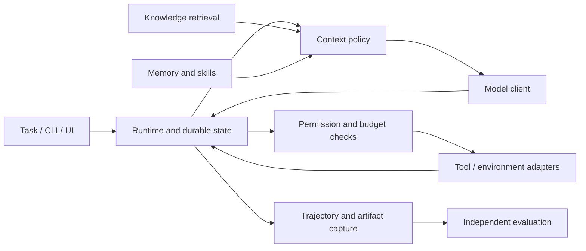

# Agent runtime and knowledge design

[Overview](README.md) · [Tasks](ROADMAP.md) · [Evaluation/training](LEARNING.md) · [Code map](../../docs/system/code-map.md#agent-track)

Status: planned engineering design. Logical contracts are approved responsibilities, not implemented or frozen Python signatures. AGT-01 materializes the first CPU-importable contracts; later tasks extend only their owned boundary.

## Requirements

| ID | Requirement | Task / evidence |
|---|---|---|
| APP-1 | Versioned RAG corpus/pipeline, retrieval and answer-quality controls | [AGT-02](ROADMAP.md#agt-02), [AGT-04](ROADMAP.md#agt-04); held-out evidence and ablations |
| APP-2 | MCP tools, explicit limits, tool behavior and structured-output checks | [AGT-03](ROADMAP.md#agt-03); real and deterministic trajectories |
| APP-3 | Versioned traces preserve content, dependencies, tool gaps, revisions and mode | [AGT-04](ROADMAP.md#agt-04); trace/export fixtures |
| APP-4 | Preserve AG-1a/b/c loop, compaction and evaluator-failure exercises and original eight hours | [AGT-03](ROADMAP.md#agt-03)–[AGT-05](ROADMAP.md#agt-05); expanded work is separately budgeted |
| AR-1 | One authoritative run lifecycle, bounded execution and recoverable durable state | [AGT-06](ROADMAP.md#agt-06); crash/resume and cancellation checks |
| AR-2 | Context/memory/skills have provenance, isolation and tested update policies | [AGT-05](ROADMAP.md#agt-05); preservation and stale-memory cases |
| AR-3 | Enforce permissions outside model text; preserve credential/action boundaries | [AGT-03](ROADMAP.md#agt-03), [AGT-06](ROADMAP.md#agt-06); adversarial input tests |
| AR-4 | Research, code, GUI and cooperative tasks reuse the runtime interfaces | [AGT-07](ROADMAP.md#agt-07)–[AGT-10](ROADMAP.md#agt-10); independent outcome checks |

## Components and flow

The runtime owns task progress. A tool owns its external execution result; a checkpoint cannot atomically establish an arbitrary external side effect. Retrieval and context policies are separate from both the model transport and the evaluator. The service transports commands/events and does not maintain a second mutable copy of run progress.

## Logical interfaces

| Contract | Required behavior / data | Owner |
|---|---|---|
| ModelClient / ModelResponse | Messages, tools, options, capability validation, model/template identity, stream/usage/finish/error; preserve raw provider payload where needed | Supplied adapters, learner capability/error tests |
| ToolSpec / ToolCall / ToolResult | Schema, permission scope, side-effect class, call/attempt IDs, observations and explicit failure/unknown outcome | Tools adapter; runtime authorizes dispatch |
| RunState / RunEvent | Run/task/workspace identity, lifecycle, budgets, context/checkpoint references; append-only observed events | Runtime |
| EvidenceRef | Corpus/document/chunk revision, source location, content identity and access scope | Knowledge pipeline |
| TaskCase / Outcome | Versioned setup, permitted actions, split/group identity, private verifier inputs, result and failure causes | Evaluation; private fields never enter model context |
| Environment | Reset, execute action, return observations, snapshot/restore, isolated scoring hook | Supplied fixture environment with learner lifecycle tests |
| Trajectory | Exact per-step model inputs/actions/observations, dependencies, revisions, budgets and outcomes | Runtime capture; learning transforms separately |

AGT-01 specifies pre/postconditions and required fields in code; it does not create unneeded abstractions for every future framework. Cross-track exchange is limited to the [endpoint and trace boundary](../../docs/system/track-contracts.md#track-boundary).

## Knowledge pipeline

### First workspace slice — AGT-01

Use one small supplied engineering service as the fixture substrate. Proposed seed: a duration-reporting regression, labeled synthetic. This is a concrete starting exercise, not an additional application or a claim of measured inference performance. Record adoption or a justified replacement under OQ-08 before generating fixtures.

| Visible fixture | Proposed content / purpose |
|---|---|
| Versioned documentation | An API returns elapsed seconds; its report field is milliseconds. Include a source/version location suitable for citation. |
| Source snapshot | A tiny service/reporting function with a seeded `seconds * 10000` conversion instead of `seconds * 1000`; supply implementation plumbing. |
| Operational records | Three synthetic durations: 0.02, 0.03, 0.04 seconds; reported values 200, 300, 400 ms. Preserve raw versus reported columns. |
| Issue/dashboard state | One open regression issue with a deterministic ID and initial state; interactive browser plumbing is supplied when AGT-08 begins. |
| Private verifier assets | Expected unit conversion, exact query/result checks and independent behavior tests; stored outside the agent's mounted workspace. |

Independent worked oracle: the reported mean is 300 ms; the mean computed from raw seconds is 30 ms. The discrepancy is 10× and reflects the seeded reporting error, not evidence that serving became slower. A SQL answer returning 300 alone cannot establish the diagnosis. Later tasks reuse this seed for cited explanation, diagnosis, patch/test, dashboard update and approved handoff; expand task families for generalization rather than calling these correlated variants independent test examples.

AGT-01 delivers a version manifest, resettable visible snapshot and separately controlled verifier inputs, plus CPU-importable contracts. It does not deliver RAG, a model loop, browser automation or training. The fixture launcher/reset plumbing is supplied; the learner defines identity, permitted actions, access separation and state-oracle semantics. A reset restores files, database and issue state; a second run must not inherit the first run's writes.

Specify explicit projections from a private TaskCase to model-visible task information. Test that hidden labels, verifier source and credentials cannot appear in the projection or mount. A reset/snapshot is not a generic security sandbox; enforcement still needs the later tool/service tests. Two small fixture namespaces are enough to check isolation before the full pilot is collected.

### Pipeline behavior

Ingest → normalize/version → chunk → embed/index → retrieve → fuse/rerank → construct evidence-bearing prompt → model → independent answer checks.

Qdrant remains the vector-store default, with local BM25 and learner-owned RRF/chunk/prompt experiments. pgvector is a comparison, not a second required production pipeline. Supplied code handles connectors, store setup, model loading and service transport. Record embedding/reranker revisions, chunk IDs, corpus version, candidate ranks, exact rendered prompt identity and stage timings.

Requirements include idempotent re-ingestion, changed/deleted-document handling, metadata/access filtering, invalidating stale evidence and reporting missing evidence. A corpus snapshot is immutable for a comparison; new content creates a new manifest/index revision. Filter permissions during retrieval and before emission. Do not claim a removed document is inaccessible while it survives in an agent memory or context.

Compare dense versus BM25+dense; RRF configuration; reranker off/on; chunk policy; static-first versus changed prompt layout. Stable prefixes may help serving reuse but do not guarantee lower latency. Diagnose retrieval failure separately from evidence-ignoring generation. [Evaluation protocol](LEARNING.md#datasets-and-splits)

## Harness and tool lifecycle

The initial loop builds context, requests a model action, validates/authorizes calls, executes eligible tools, appends linked observations, and continues or terminates. The same primitives later run inside LangGraph. The authored loop remains a small reference/test path; do not duplicate tool, retrieval or evaluator implementations inside framework nodes.

Suggested lifecycle: queued → running → waiting-for-tool or waiting-for-human → running → succeeded/failed/cancelled/budget-exhausted. Record the exact transition contract in AGT-01; externally ambiguous tool outcomes remain unresolved tool-attempt states, not fabricated successes. Persist terminal reasons and partial artifacts.

Initial tools remain docs_search, read-only benchmark SQL and constrained execution. Later adapters add repository read/patch/test, browser actions and delegation. SQL uses a read-only connection and bounded execution/result size; a string check alone does not enforce read-only behavior. Sandboxed edits may proceed within task-granted permissions; actions outside the sandbox require the explicitly supported approval flow.

Validate unknown tools, malformed arguments, schema versus semantic validity, duplicate call/result IDs, provider failures and transport errors. Retries are bounded and classified by recoverability. Parallelize only independent calls; preserve dependencies and deterministic result linkage. Tool-result caching keys include arguments, tool/data revision and access namespace; side effects are not blindly cached or retried.

Step, token, elapsed-time and cash limits apply across tools and subagents. Reserve estimated concurrent-call budgets before dispatch, reconcile actual usage, and label missing usage as unknown/estimated rather than zero. A cancellation stops new actions and records any in-flight/unknown outcomes.

## Context, memory and skills

Active context is derived from full history; it is not the evidence store. Compact older complete interactions while retaining the task, constraints and complete recent action/result pairs. Keep full trajectories and record the compaction event, before/after prompt identity, token counts and tokenizer/template revisions. Validate with deterministic summaries before one bounded live comparison.

Test compaction by continuing the task: preserve a planted constraint, delayed dependency and earlier relevant observation. A shorter context can damage task quality or prefix reuse. Never substitute compression ratio for continuation quality.

Distinguish working context, episodic records, factual memory and procedural skills. Entries carry source/revision, owner/namespace, creation/update evidence and lifecycle state. Support correction/conflict resolution, retirement/deletion and stale-data checks. Evaluate memory-off against memory-on on held-out tasks, including harmful over-retrieval.

Skills use progressive disclosure and an admission process: propose from authored guidance or trajectories → inspect/test → admit → retrieve/use → repair/retire. Generated code skills run under the same sandbox/permission rules. A judge accepting a skill is not independent proof that it is safe or useful. Full memory/skill exercises are new scope beyond AG-1b's original three hours.

## Durable service, interaction and observability

Use LangGraph checkpoints for persisted workflow state. Proposed initial backend: SQLite for local exercises, subject to the pinned checkpointer's recovery/concurrency behavior. PostgreSQL is an alternative if a measured service requirement warrants it, not another mandatory deployment. Resolve the backend in AGT-06. Keep authoritative run state in the selected persistence mechanism, not a competing hand-written workflow engine. Store tool-attempt identifiers/results so recovery can distinguish never-dispatched, completed, failed and unknown executions.

Required recovery experiment: crash after a tool side effect but before its result is checkpointed. Reconcile via status/idempotency support; if unavailable, surface uncertainty and request resolution. Do not claim exactly-once external execution. Approval binds to the intended action/target/arguments; changed parameters or a changed artifact invalidate stale approval.

CLI precedes a supplied minimal UI/API exposing start, progress/events, clarification/approval, cancel/resume and final artifacts. No broad product UI or separate Kubernetes control plane is required. Teach streaming disconnect versus actual task cancellation; declare which operation the client requests.

OpenTelemetry/Phoenix captures model, retrieval, tool and evaluator spans with parent IDs, outcomes, latency and cost origin. Redact secrets and sensitive content in telemetry; keep full reproducibility records in appropriately restricted artifacts. Debug from task failure to stage and request. Safety starts in AGT-03; service hardening extends it in AGT-06.

Untrusted retrieved text/tool output cannot grant permissions. Scope credentials per adapter, keep them outside generated-code environments, and teach local stdio versus remote MCP authentication/transport boundaries against the pinned specification. Test document injection, attempted credential disclosure, namespace crossing and policy bypass. The supplied runner is a bounded teaching environment, not a general hardened sandbox claim.

## Domain capabilities and alternatives

- Planning/research: explicit dependencies, replan after changed evidence, retrieval/search stopping criteria, source conflict and citation verification. Preserve a reactive baseline.
- Coding: localize–edit–verify, resettable worktrees, bounded patch application and independent hidden behavior checks. The agent cannot edit its trusted evaluator or count weakened tests as success.
- Computer use: DOM/accessibility and screenshot observations, grounded actions, resettable local dashboard, independent end-state checks. A successful click or plausible screenshot alone is insufficient.
- Multi-agent/human interaction: bounded delegation and A2A exercise, shared budgets, separate workspaces where appropriate, clarification and stale approvals. Compare with one agent under declared aggregate resource budgets.
- Critics/search: score candidates independently, snapshot reversible branches, and enforce branch/time/token limits. Search cannot replay irreversible actions across imagined branches. Distinguish evidence reranking, answer critics, RL value models and inference-engine token scheduling.

OpenHands is operated on the same fixture workspace and modified through one tool/skill boundary. DeepAgents, ADK and Microsoft Agent Framework remain explicit architecture/API exercises. Select source revisions at handoff; no whole-repository forks are embedded in agent_lab.

## Trace capture and performance export

Preserve run/session/request/parent IDs, exact rendered prompts or reconstructible token identity, template/model/tool/corpus revisions, tool/think gaps, events, outcomes, measurement mode and context-compaction metadata. Do not invent unavailable hidden model reasoning or exact token counts. Full internal trajectories, redacted observability spans and exported performance traces are distinct representations with linked identities.

Capture roughly 50 varied initial sessions with explicit reuse/reset policy. Repetition for load does not create new task diversity. Export the versioned SessionTrace envelope used by inference benchmarks; additive metadata must not make old fixtures unreadable. Inference owns parent-DAG eligibility, timing denominators and performance replay; this track owns live task semantics and training rollouts. [Measurement contract](../inference/engineering/measurement.md)

## Correctness and acceptance

Use independent fixtures for missing evidence, retrieval/generation failure, insufficient tool-capable models, malformed calls, exhausted limits, timeout/unknown outcome, duplicates, context overflow, lost constraints, invalid dependency DAGs, memory leakage and evaluator false confidence. Deterministic fixtures establish harness correctness, not real model-quality success.

The [task roadmap](ROADMAP.md) owns completion records. December closes the RAG gate; the original complete pilot/live-quality gate remains required with a January target. Runtime/service completion requires crash/resume, permission and cancellation evidence; exact SDK adapters and tested versions are locked during their tasks.
