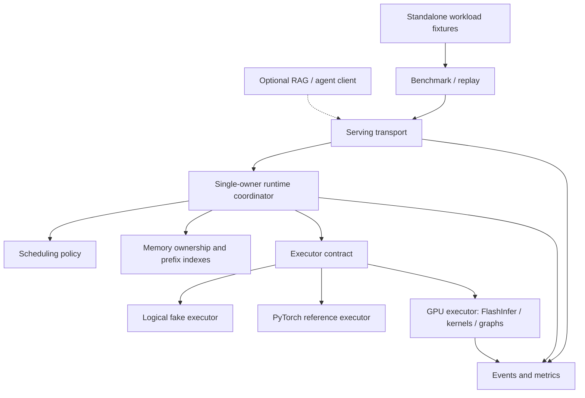

# Inference system architecture

[Index](../../README.md) · [Code map](../../docs/system/code-map.md) · [Project goals](../../PROJECT_PLAN.md#goals-and-non-goals)

Status: approved logical boundaries, planned implementation. Concrete signatures and version-specific adapters are not frozen. The code-map paths are planned; no runtime interfaces have been implemented. FND-01 will materialize typed contracts with field documentation, preconditions/postconditions and explicit NotImplementedError bodies for unfinished methods; the planning inventory does not close that task.

## Components and dependency direction

Applications and benchmarks use HTTP endpoints. A gateway may route those requests among equivalent replicas in one model pool. A production vLLM or SGLang endpoint can replace the custom runtime endpoint without being imported into its scheduler. [Routing design](design/routing-platform.md)

The coordinator is the sole mutator of request lifecycle; the block pool is the sole authority for physical-page allocation/refcounts. Scheduling proposes work and cache operations return explicit leases; only the coordinator commits the combined transition. Transport handlers enqueue events rather than freeing resources. Begin with one execution step in flight; overlap is a bounded later exercise, not an implicit multi-stream runtime requirement.

## Logical interfaces

These are responsibilities to implement, not existing Python/Go symbols. Put framework-specific tensors and RPC objects behind adapters. Keep CPU state/policy imports independent of CUDA, downloaded models, and Kubernetes.

| Contract | Inputs / outputs | Owner and invariants |
|---|---|---|
| ModelSpec / CacheIdentity | Model/tokenizer/template revisions, dimensions, adapter/namespace, representation identity | Model adapter validates one supported dense family; cache identity prevents incompatible reuse |
| GenerationRequest / RequestState | Input IDs, supported generation controls, limit/deadline, identity; terminal outcome and emitted IDs | Coordinator distinguishes planned/computed/sampled/emitted counts |
| BlockPool / BlockLease | Reserve, append, share, copy-on-write, retain, release; handles and accounting | Memory manager owns refcounts and page lifetime |
| PrefixIndex | Match/acquire, publish completed pages, release, evict; reusable token count and leases | Hash and radix share page eligibility/ownership rules |
| Scheduler / StepPlan | Request snapshot, budgets, pressure; token ranges, actions, and proposed victims | Policy does not perform GPU work or irreversibly mutate allocation |
| Executor / StepResult | Prepared token/position/page metadata; completion status and output/logit data | Backend does not independently finish requests or free leases |
| ServingEvent / RequestObservation | Server state events; separately, client monotonic arrival/content/finish observations | Metrics preserve origin/units and do not subtract unrelated process clocks |
| SessionTrace / ReplayPolicy | Recorded prompts, parents, tool gaps, provenance; eligible requests | Fixed transcript, fixed arrival, and live execution retain distinct meaning |
| Go RoutingPolicy | Request metadata, endpoint snapshots, policy settings; ranked decision/reasons | Pure scoring core separate from EPP types and state adapters |

Agent context, tools, task evaluation and training are independent application boundaries owned by the [agent runtime](../agents/RUNTIME.md) and [learning design](../agents/LEARNING.md). They use endpoint/trace contracts without importing the inference engine.

Contract records and engine state must not become two independently writable copies of request progress. FND-01 chooses concrete type placement/re-exports; the coordinator retains one authoritative request state and policies receive observations of it. File names describe responsibilities, not a requirement to duplicate a type in both contracts/requests.py and engine/scheduling/state.py.

## Request/control flow

1. Transport validates the supported API subset and uses the supplied tokenizer/template adapter. Persist exact input identity for comparison/replay.
2. Coordinator admits or rejects the request and creates owned state; scheduler observes an immutable/logically stable view.
3. Prefix lookup may acquire completed pages; scheduler proposes token work under compute/memory budgets.
4. Coordinator reserves/COWs pages and prepares execution metadata. Failed reservation rolls back before execution.
5. Executor runs the step. Only successful completion makes KV writes publishable. Coordinator commits progress and samples/emits according to the request state.
6. Cancel/error/finish follows one cleanup path, retaining in-flight leases until safe. Events report the actual terminal outcome.

Replay and experiments observe this path externally. The custom runtime supports rendered-text replay even when production engines provide richer structured-output/tool-call APIs.

## Source organization

Use `src/inferstack/` for one Python package: contracts, engine, backends, serving and bench. Agent source belongs under `tracks/agents/src/agent_lab/` with its own application/training environments; the former `inferstack/workloads` paths are relocated in the code map. Keep Go in `routing/`, deployment recipes in `deploy/`, environment records in `environments/`, and experiment profiles in `configs/`. Preserve the existing standalone `starter/` utility; benchmarks will accept its prepared output directory instead of duplicating bundle logic.

Teaching modules import the production implementation and use isolated small exercises/fixtures/reference solutions. Production never imports teaching references. The current [code map](../../docs/system/code-map.md) lists planned file responsibilities; there is no installable package configuration or runnable serving CLI yet.

## Isolation and future extension

Separate CPU development, custom GPU runtime, production-engine images, and Go/platform dependencies. Do not force SGLang and vLLM into one Python environment. Keep workloads/embeddings and heavy local deployments sequential on the 16 GB Mac.

Preserve later extensions at model loading/backend selection (quantization), token commitment/KV rollback (speculation), executor (TP/EP), explicit ownership (offload), endpoint observations/deployment (scaling), and prefill/decode state (P/D). Do not create unused advanced runtime abstractions before the bounded labs justify them. [Advanced scope](design/advanced-labs.md)

## Design maturity

Approved: one dense model family, the boundaries above, separate simulators, single-owner lifecycle, matched cache comparison, isolated environments. Proposed: concrete Python data-container choices and operational failure recovery; see OQ-03–OQ-12 in [open decisions](../../docs/engineering/open-questions.md). New public API behavior must be documented in the owning design before implementation.

## Optional track integration

The [shared track contract](../../docs/system/track-contracts.md#track-boundary) owns endpoint and SessionTrace exchange. The agent application and inference runtime remain independently usable.

## First contract slice — FND-01

Materialize only the metadata needed for the next CPU tasks. Proposed implementation default: ordinary typed Python records/enums with explicit validation; select the exact container/library in FND-01 based on serialization and dependency needs. No GPU framework is needed to represent these values.

| Boundary | Minimum information to settle | Independent check |
|---|---|---|
| ModelSpec and identity | Supported dense family, explicit head dimension, head/layer counts, model/tokenizer/template revisions, representation/namespace identity | Reject impossible head grouping or unsupported family; preserve distinct cache identities |
| Request and progress view | Request identity, input token IDs, supported limits, distinct computed/sampled/emitted counts and terminal intent | Round-trip identity; reject negative limits/counts; never equate sampled output with computed KV |
| Prepared step and result metadata | Request identity, token/position ranges, backend-visible references, success/failure and completion identity | Mismatched request/step result is detectable; unsupported execution fails explicitly |
| Client/server observations | Origin, clock domain, event kind, terminal outcome and count provenance | A metadata-only event cannot become first generated content; unrelated clock domains remain distinct |

Keep physical tensors, page allocation algorithms, lifecycle transition policy, SSE server and real scheduler out of this first slice. Contract validation belongs here; SCH-01 and KV-01 own behavior/state mutation. Do not create a second writable progress record in both contracts and scheduler packages.

Teaching fixture: request R0 has prompt IDs `[11, 12]`. After a completed two-token prefill and sampling token 13, `computed=2`, `sampled=1`, `emitted=0`; after transport emits it, `emitted=1` while `computed` stays 2. Token 13 receives KV only after a later model execution. Ask the learner to explain why a sampled token is not a cache write and why cancellation cannot free an in-flight lease. FND-01 records these distinctions; the later lifecycle tests implement their transitions.

Acceptance is a small importable contract package with meaningful positive/negative fixtures and tested environment notes. A full decoder, HTTP endpoint or virtual scheduler is not needed to close FND-01. Add package/test discovery metadata only as needed to run its checks from a clean CPU environment, and document the actual commands.
